## Содержание

- [Содержание](#содержание)
- [1. Введение в ИБ, основные понятия, сущность, задачи ИБ.](#1-введение-в-иб-основные-понятия-сущность-задачи-иб)
  - [Классификация угроз](#классификация-угроз)
- [2. Идентификация и аутентификации. Биометрия. Основные протоколы аутентификации.](#2-идентификация-и-аутентификации-биометрия-основные-протоколы-аутентификации)
  - [Touch Memory](#touch-memory)
  - [RFID](#rfid)
    - [Классификация RFID-меток](#классификация-rfid-меток)
      - [По типу питания](#по-типу-питания)
      - [По видам памяти](#по-видам-памяти)
      - [По исполнению (определяется целями и условиями использования RFID-меток)](#по-исполнению-определяется-целями-и-условиями-использования-rfid-меток)
  - [NFC](#nfc)
  - [Карты с магнитной полосой](#карты-с-магнитной-полосой)
  - [Штрих и QR code](#штрих-и-qr-code)
  - [Биометрия](#биометрия)
    - [Статические методы](#статические-методы)
    - [Динамические методы](#динамические-методы)
  - [Технологии аутентификации](#технологии-аутентификации)
  - [Смарт-карты](#смарт-карты)
  - [Электронный идентификатор Рутокен](#электронный-идентификатор-рутокен)
  - [Электронные ключи eToken ](#электронные-ключи-etoken)
  - [Парольная аутентификация](#парольная-аутентификация)
  - [Одноразовые пароли (OTP – One Time Password)](#одноразовыепаролиotp--one-time-password)
    - [Варианты реализации систем аутентификации по одноразовым паролям](#варианты-реализациисистем-аутентификации-по-одноразовым-паролям)
      - [Метод «запрос-ответ».](#метод-запрос-ответ)
      - [Метод «только ответ»](#метод-только-ответ)
      - [Метод «синхронизация по времени».](#метод-синхронизация-по-времени)
      - [Метод Метод «синхронизация по событию»](#метод-метод-синхронизация-по-событию)
- [3. Введение в Криптографию, Криптографические Примитивы, Комбинированные Методы Шифрования и Основные Протоколы](#3-введение-в-криптографию-криптографические-примитивы-комбинированные-методы-шифрования-и-основные-протоколы)
  - [Основы Криптографии](#основы-криптографии)
  - [Почему Симметричные и Асимметричные Методы Шифрования Часто Используются Вместе?](#почему-симметричные-и-асимметричные-методы-шифрования-часто-используются-вместе)
  - [Тест на Криптографа: Создание Защищенного Сообщения](#тест-на-криптографа-создание-защищенного-сообщения)
  - [MITM-атака и Удостоверяющие Центры](#mitm-атака-и-удостоверяющие-центры)
  - [Защищенная Коммуникация: Итоговый Процесс](#защищенная-коммуникация-итоговый-процесс)
  - [SSL/TLS: Пример Клиент-Серверного Протокола](#ssltls-пример-клиент-серверного-протокола)
- [4. Математические основы защиты информации: теория групп, колец, их свойства](#4-математические-основы-защиты-информации-теория-групп-колец-их-свойства)
- [5. Математические основы защиты информации: функция Эйлера, квадратичный вычет/невычет, асимптотический закон распределения простых чисел.](#5-математические-основы-защиты-информации-функция-эйлера-квадратичный-вычетневычет-асимптотический-закон-распределения-простых-чисел)
- [6. Символ Лежандра/Якоби, их свойства, алгоритмы вычисления.](#6-символ-лежандраякоби-их-свойства-алгоритмы-вычисления)
- [7. Методы поиска простых чисел. Детерминированные методы (Решето Эрастосфена, Аткина, тест АКС, метод пробных делений).](#7-методы-поиска-простых-чисел-детерминированные-методы-решето-эрастосфена-аткина-тест-акс-метод-пробных-делений)
- [8. Методы поиска простых чисел. Вероятностные методы (Ферма, Соловея Штрассена, Леммера, псевдопростые числа).](#8-методы-поиска-простых-чисел-вероятностные-методы-ферма-соловея-штрассена-леммера-псевдопростые-числа)
- [9. Методы поиска простых чисел. Тест Миллера-Рабина. Строго псевдопростые числа, оценка эффективности.](#9-методы-поиска-простых-чисел-тест-миллера-рабина-строго-псевдопростые-числа-оценка-эффективности)
- [10. Введение в асимметричные методы шифрования. Преимущества и недостатки. Алгоритм Диффи-Хеллмана.](#10-введение-в-асимметричные-методы-шифрования-преимущества-и-недостатки-алгоритм-диффи-хеллмана)
- [11. Алгоритм Диффи-Хеллмана. Атаки на него (MITM, дискретное логарифмирование). протокол STS.](#11-алгоритм-диффи-хеллмана-атаки-на-него-mitm-дискретное-логарифмирование-протокол-sts)
  - [**Атаки на алгоритм Диффи-Хеллмана**:](#атаки-на-алгоритм-диффи-хеллмана)
    - [**MITM атака**](#mitm-атака)
    - [Дискретное логарифмирование](#дискретное-логарифмирование)
  - [Протокол STS](#протокол-sts)
- [12. Алгоритм RSA. Вспомогательная функция. Атака Хастеда, на основе малой экспоненты, Винера](#12-алгоритм-rsa-вспомогательная-функция-атака-хастеда-на-основе-малой-экспоненты-винера)
  - [Генерация ключей](#генерация-ключей)
  - [Шифрование](#шифрование)
  - [Вспомогательная функция](#вспомогательная-функция)
  - [Атаки на алгоритм RSA](#атаки-на-алгоритм-rsa)
- [13. Методы факторизации натуральных чисел. Экспоненциальные алгоритмы (Ферма, Ро-метод, P-1 метод, p+1 Метод Уильямса).](#13-методы-факторизации-натуральных-чисел-экспоненциальные-алгоритмы-ферма-ро-метод-p-1-метод-p1-метод-уильямса)
  - [Метод Ферма](#метод-ферма)
  - [$\\rho$-Метод Полларда](#rho-метод-полларда)
  - [$p-1$-Метод Полларда](#p-1-метод-полларда)
    - [Первая стадия:](#первая-стадия)
    - [Вторая стадия:](#вторая-стадия)
  - [$(p+1)$-Метод Уильямса](#p1-метод-уильямса)
- [14. Методы факторизации субэкспоненциальной сложности. Метод квадратичного решета.](#14-методы-факторизации-субэкспоненциальной-сложности-метод-квадратичного-решета)
  - [Метод Квадратичного решета.](#метод-квадратичного-решета)
- [15. Дискретное Логарифмирование. Алгоритм Гельфонда-Шэнкса (Baby-step Giant-step)](#15-дискретное-логарифмирование-алгоритм-гельфонда-шэнкса-baby-step-giant-step)
- [16. Дискретное Логарифмирование. $\\rho$-метод Полларда для дискретного логарифмирования.](#16-дискретное-логарифмирование-rho-метод-полларда-для-дискретного-логарифмирования)
- [17. Введение в симметричные методы шифрования. Примитивные операции. Блочные и поточные шифры. Сеть Фейстеля, SP-сети.](#17-введение-в-симметричные-методы-шифрования-примитивные-операции-блочные-и-поточные-шифры-сеть-фейстеля-sp-сети)
- [18. Введение в симметричные методы шифрования. Простые алгоритмы шифрования (Цезаря, АТБАШ, Play-fire, шифр сдвига, магический квадрат, гаммирование, Вижнера).](#18-введение-в-симметричные-методы-шифрования-простые-алгоритмы-шифрования-цезаря-атбаш-play-fire-шифр-сдвига-магический-квадрат-гаммирование-вижнера)
- [21. Алгоритм DES. Раундовые Ключи.](#21-алгоритм-des-раундовые-ключи)
- [22. Алгоритм DES. Схема шифрования и раундовая функция.](#22-алгоритм-des-схема-шифрования-и-раундовая-функция)
- [23. Алгоритм DES. Режимы работы.](#23-алгоритм-des-режимы-работы)
- [24. Алгоритм ГОСТ 28147-89](#24-алгоритм-гост-28147-89)
  - [Шифрование](#шифрование-1)
  - [Раундовая функция](#раундовая-функция)
  - [S-блоки](#s-блоки)
- [25. Алгоритм AES. Шифрование. 4 Преобразования.](#25-алгоритм-aes-шифрование-4-преобразования)
  - [Шифрование](#шифрование-2)
  - [4 Преобразования](#4-преобразования)
    - [SubByte()](#subbyte)
    - [ShiftRows()](#shiftrows)
    - [MixColumns()](#mixcolumns)
    - [AddRoundKey()](#addroundkey)
  - [Расшифровка](#расшифровка)
- [26. Алгоритм AES. Раундовые ключи.](#26-алгоритм-aes-раундовые-ключи)
- [27. Хэш функции. Свойства.](#27-хэш-функции-свойства)
  - [Свойства Хэш функции](#свойства-хэш-функции)
- [28. Хэш функции. Схема Меркеля-Дамгарда.](#28-хэш-функции-схема-меркеля-дамгарда)
- [29. Хэш функции. Алгоритм SHA-1. Добавление недостающих битов и указание длины, Инициализация буфера](#29-хэш-функции-алгоритм-sha-1-добавление-недостающих-битов-и-указание-длины-инициализация-буфера)
  - [Характеристики](#характеристики)
  - [Добавление недостающих битов и указание длины](#добавление-недостающих-битов-и-указание-длины)
  - [Инициализация буфера](#инициализация-буфера)
- [30. Хэш функции. Алгоритм SHA-1. Обработка сообщений. Выход.](#30-хэш-функции-алгоритм-sha-1-обработка-сообщений-выход)
  - [Обработка сообщений](#обработка-сообщений)
  - [Выход](#выход)
- [31. Электронно-цифровая подпись. Пример на основе  RSA и MD5](#31-электронно-цифровая-подпись-пример-на-основе--rsa-и-md5)
  - [Пример на основе RSA и MD5](#пример-на-основе-rsa-и-md5)
- [32. Протокол X. 509](#32-протокол-x-509)
- [33. Протокол SSL/TLS](#33-протокол-ssltls)
- [34. Протоколы доказательства с нулевым разглашением секрета (Подбрасывание монеты, пещера Али-Бабы, кубик Рубика).](#34-протоколы-доказательства-с-нулевым-разглашением-секрета-подбрасывание-монеты-пещера-али-бабы-кубик-рубика)
  - [Протокол подбрасывания монеты по телефону](#протокол-подбрасывания-монеты-по-телефону)
    - [Задача пещеры АлиБабы](#задача-пещеры-алибабы)
    - [Задача Кубик-Рубика](#задача-кубик-рубика)
- [35. Электронное голосование](#35-электронное-голосование)
- [36. Электронные торги (Тендеры).](#36-электронные-торги-тендеры)
- [37. Задача Гроссмейстеров](#37-задача-гроссмейстеров)

## 1. Введение в ИБ, основные понятия, сущность, задачи ИБ.

**Информационная безопасность** – это состояние информационной системы, в котором угрозы нарушения конфиденциальности, целостности и доступности информации сведены к минимуму.

**Конфиденциальность** - состояние информации, при котором доступ к ней осуществляют только субъекты, имеющие на него право.
**Целостность** – состояние информации, при котором отсутствует любое ее изменение либо изменение осуществляется только преднамеренно субъектами, имеющими на него право.
**Доступность**– состояние информации, при котором субъекты, имеющие право доступа, могут реализовывать его беспрепятственно.

**Правила (3 золотых правила):**

1. Аутентификация - показываем системе идентификатор для получения доступа

2. Авторизация - у разных пользователей есть разные права и для них даются разные уровни доступа

3. Аудит - запись, анализ всех действий с данными. Логирование, проверки.

**Главная задача**: Минимизация угроз.

Полностью защитить невозможно никакую систему. Угрозы: Хакеры, кроты, перехват. Защиты от танков и бпла тоже считается. Направлений много. Мы отвечаем за программные методы, а именно криптографию.

**Комплексность**—решение в рамках единой концепции двух или более разноплановых задач (**целевая комплексность**), или использование для решения одной и той же задачи разноплановых инструментальных средств (**инструментальная комплексность**), или то и другое (**всеобщая комплексность**).
**Целевая комплексность** означает, что система информационной безопасности должна строиться следующим образом:

- защита информации, информационных ресурсов и систем личности, общества и государства от внешних и внутренних угроз;

- защита личности, общества и государства от негативного информационного воздействия.

**Инструментальная комплексность** подразумевает интеграцию всех видов и направлений ИБ для достижения поставленных целей.
**Структурная комплексность** предполагает обеспечение требуемого уровня защиты во всех элементах системы обработки информации.
**Функциональная комплексность** означает, что методы защиты должны быть направлены на все выполняемые функции системы обработки информации.
**Временная комплексность** предполагает непрерывность осуществления мероприятий по защите информации как в процессе непосредственной ее обработки, так и на всех этапах жизненного цикла объекта обработки информации.

**Угроза ИБ** -  потенциально возможное событие, которое может привести к нанесению вреда информационной системе и хранящейся в ней информации.

### Классификация угроз

По **природе возникновения** угрозы делятся на:

- естественные угрозы,
  вызванные естественными физическими процессами или
  природными явлениями (наводнениями, землетрясениями,
  сбоями электропитания и т.п);

- искусственными угрозами, вызванными
  деятельность человека (некомпетентные действия персонала, действия хакеров,
  злоумышленные действия конкурентов и т.п.).

По **степени преднамеренности** угрозы различаются как:

- угрозы, вызванные ошибками или халатностью персонала, например, неправильное использование информационной системой;

- угрозы преднамеренного действия, например, действия злоумышленников.

По **местоположению** угрозы могут быть:

- вне зоны расположения ИС;

- в пределах контролируемой зоны ИС;
  непосредственно в ИС, например, зараженные вирусами программные средства.

По **степени вреда**, наносимого информационной системе:

- несущественное, легко восстановимое нарушение работы ИС;

- существенное нарушение работы ИС, требующие серьезных мер по восстановлению нормальной работы;

- критическое воздействие на работу ИС, вызвавшее полное крушение системы, или важных компонент ее работы, потеря жизненно важной информации, хранящейся в системе, блокирование каналов связи, требующее длительного времени восстановления и другие угрозы, наносящие существенный вред информационной системе.

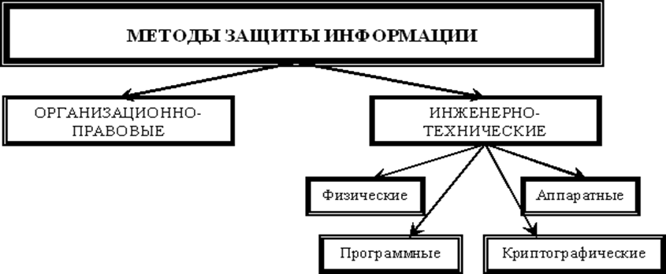

К методам и средствам **организационной защиты** информации относятся организационно-технические и организационно-правовые мероприятия, проводимые в процессе создания и эксплуатации КС для обеспечения защиты информации.

**Инженерно-техническая защита** (ИТЗ) – это совокупность специальных органов, технических средств и мероприятий по их использованию в интересах защиты конфиденциальной информации.

По **функциональному назначению** средства инженерно-технической защиты делятся на следующие группы:

- **физические средства**, включающие различные средства и сооружения, препятствующие физическому проникновению (или доступу) злоумышленников на объекты защиты и к материальным носителям конфиденциальной информации и осуществляющие защиту персонала, материальных средств, финансов и информации от противоправных воздействий;

- **аппаратные средства** – приборы, устройства, приспособления и другие технические решения, используемые в интересах защиты информации. Основная задача аппаратных средств – обеспечение стойкой защиты информации от разглашения, утечки и несанкционированного доступа через технические средства обеспечения производственной деятельности;

- **программные средства**, охватывающие специальные программы, программные комплексы и системы защиты информации в информационных системах различного назначения и средствах обработки (сбор, накопление, хранение, обработка и передача) данных;

- **криптографические средства** – это специальные математические и алгоритмические средства защиты информации, передаваемой по системам и сетям связи, хранимой и обрабатываемой на ЭВМ с использованием разнообразных методов шифрования

**Физические средства защиты** – это разнообразные устройства, приспособления, конструкции, аппараты, изделия, предназначенные для создания препятствий на пути движения злоумышленников.
К физическим средствам относятся механические, электромеханические, электронные, электронно-оптические, радио– и радиотехнические и другие устройства для воспрещения несанкционированного доступа (входа, выхода), проноса (выноса) средств и материалов и других возможных видов преступных действий.
Эти средства применяются для решения следующих задач:
   - охрана территории предприятия и наблюдение за ней;
   - охрана зданий, внутренних помещений и контроль за ними;
   - охрана оборудования, продукции, финансов и информации;
   - осуществление контролируемого доступа в здания и помещения.

К **аппаратным средствам защиты** информации относятся самые различные по принципу действия, устройству и возможностям технические конструкции, обеспечивающие пресечение разглашения, защиту от утечки и противодействие несанкционированному доступу к источникам конфиденциальной информации.
Аппаратные средства защиты информации применяются для решения следующих задач:

- проведение специальных исследований технических средств обеспечения производственной деятельности на наличие возможных каналов утечки информации;

- выявление каналов утечки информации на разных объектах и в помещениях;
  локализация каналов утечки информации;

- поиск и обнаружение средств промышленного шпионажа;

- противодействие несанкционированному доступу к источникам конфиденциальной информации и другим действиям.

**Программные методы и средства**:

- средства собственной защиты, предусмотренные общим программным обеспечением;

- средства защиты в составе вычислительной системы;

- средства защиты с запросом информации;

- средства активной защиты;

- средства пассивной защиты и другие.

**Направления** использования программ для обеспечения безопасности конфиденциальной информации:

- защита информации от несанкционированного доступа;

- защита информации от копирования;

- защита программ от копирования;

- защита программ от вирусов;

- защита информации от вирусов;

- программная защита каналов связи

**Программные средства защиты** имеют следующие разновидности специальных программ:

- идентификации технических средств, файлов и аутентификации пользователей;

- регистрации и контроля работы технических средств и пользователей;

- обслуживания режимов обработки информации ограниченного пользования;

- защиты операционных средств ЭВМ и прикладных программ пользователей;

- уничтожения информации в защитные устройства после использования;

- сигнализирующих нарушения использования ресурсов;

- вспомогательных программ защиты различного назначения.

**Криптографические методы защиты информации** – это мощное оружие в борьбе за информационную безопасность.

**Криптография** (от древне-греч. κρυπτος – скрытый и γραϕω – пишу) – наука о методах обеспечения конфиденциальности и аутентичности информации.

**Криптография** представляет собой совокупность методов преобразования данных, направленных на то, чтобы сделать эти данные бесполезными для злоумышленника. Такие преобразования позволяют решить два главных вопроса, касающихся безопасности информации:
   - защиту конфиденциальности;
   - защиту целостности.

**Задачи криптографии**:

- шифрование всего информационного трафика, передающегося через открытые сети;

- криптографическая аутентификация, обеспечивает связь разноуровневых объектов;

- защита несущего данный трафика средствами имитозащиты  (защита от завязания ложных сообщений) и цифровые подписи с целью обеспечения целостности и достоверности предоставляемой информации;
  шифрование данных, предоставленных в виде файлов или хранящихся в виде базы данных;

- контроль целостности программного обеспечения путем применения криптографически стойких контрольных сумм;

- применение цифровой подписи для обеспечения юридической значимости документов, применение затемняющей цифровой подписи для обеспечения неотслежимости клиента, платформы системы основанных на электронных деньгах.

Организационное обеспечение компьютерной безопасности включает в себя
ряд мероприятий:

- организационно-административные;

- организационно-технические;

- организационно-экономические.

Организационно-административные мероприятия предполагают:

- минимизацию утечки информации через персонал (организация мероприятий по подбору и расстановке кадров, создание благоприятного климата в коллективе и т.д.);

- организацию специального делопроизводства и документооборота для конфиденциальной информации, устанавливающих порядок подготовки, использования, хранения, уничтожения и учета документированной информации на любых видах носителей;

- выделение специальных защищенных помещений для размещения средств вычислительной техники и связи, а также хранения носителей информации;

- выделение специальных средств компьютерной техники для обработки конфиденциальной информации;

- организацию хранения конфиденциальной информации на промаркированных отчуждаемых носителях в специально отведенных для этой цели местах;

- использование в работе сертифицированных технических и программных средств, установленных в аттестованных помещениях;

- организацию регламентированного доступа пользователей к работе со средствами компьютерной техники, связи и в хранилище (архив) носителей конфиденциальной информации;

- установление запрета на использование открытых каналов связи для передачи конфиденциальной информации;

- контроль соблюдения требований по защите конфиденциальной информации.

Система организационных мероприятий, направленных на максимальное
предотвращение утечки информации через персонал включает:

- оценка у претендентов на вакантные должности при подборе кадров таких личностных качеств, как порядочность, надежность, честность и т.д.;

- ограничение круга лиц, допускаемых к конфиденциальной информации;

- проверка надежности сотрудников, допускаемых к конфиденциальной информации, письменное оформление допуска; развитие и поддержание у работников компании корпоративного духа, создание внутренней среды, способствующей проявлению у сотрудников чувства принадлежности к своей организации, позитивного отношения человека к организации в целом (лояльность);

- проведение инструктажа работников, участвующих в мероприятиях, непосредственно относящихся к одному из возможных каналов утечки информации.

Все лица, принимаемые на работу, проходят инструктаж и знакомятся с памяткой о сохранении служебной или коммерческой тайны. Памятка разрабатывается системой безопасности с учетом специфики организации.

Комплекс организационно-технических мероприятий состоит:

- в ограничении доступа посторонних лиц внутрь корпуса оборудования за счет установки различных запорных устройств и средств контроля;

- в отключении от ЛВС, Internet тех СКТ, которые не связаны с работой конфиденциальной информацией, либо в организации межсетевых экранов;

- в организации передачи такой информации по каналам связи только использованием специальных инженерно-технических средств; 

- в организации нейтрализации утечки информации по электромагнитным и акустическим каналам; 

- в организации защиты от наводок на электрические цепи узлов и блоков автоматизированных систем обработки информации; 

- в проведении иных организационно-технических мероприятий, направленных на обеспечение компьютерной безопасности.

Организационно-технические мероприятия по обеспечению компьютерной безопасности предполагают активное использование инженерно-технических средств защиты.

Проведение организационно-экономических мероприятий по обеспечению
компьютерной безопасности предполагает:

- стандартизацию методов и средств защиты информации; 

- сертификацию средств компьютерной техники и их сетей по требованиям информационной безопасности; 

- страхование информационных рисков, связанных с функционированием компьютерных систем и сетей; 

- лицензирование деятельности в сфере защиты информации.

## 2. Идентификация и аутентификации. Биометрия. Основные протоколы аутентификации.

**Идентификация** – процедура распознавания субъекта по его идентификатору. В процессе регистрации субъект предъявляет системе свой идентификатор и она проверяет наличие в своей базе данных.

**Аутентификация** - процедура проверки подлинности субъекта, позволяющая достоверно убедиться в том, что субъект, предъявивший свой идентификатор, на самом деле является именно тем субъектом, идентификатор которого он использует.

**Авторизация** – процедура предоставления субъекту определенных прав доступа к ресурсам системы после прохождения им процедуры аутентификации.

**Аудит** – это процедура записи действий всех пользователей по доступу к защищаемым данным.

### Touch Memory

Электронные ключи **Touch Memory** – одна из разновидностей электронных идентификаторов, широко применяемых во всем мире. По внешнему виду данный тип электронного ключа напоминает плоскую батарейку, толстую пуговицу или таблетку.

Второе название электронных ключей данного семейства – ключи iButton, что означает Information Button (“таблетка” с информацией). Данное название пришло на смену Touch 
Memory в начале 1997 года. Под этим названием электронные ключи Touch Memory выпускаются по сегодняшний день.

### RFID

**Технология RFID** (Radio Frequency Identification — радиочастотная идентификация) – это технология, основанная на использовании радиочастотного электромагнитного излучения.
RFID-метка – миниатюрное запоминающее устройство, которое состоит из микрочипа, хранящего информацию, и антенны, с помощью которой метка эти данные передает и получает.
В памяти RFID-метки хранится ее собственный уникальный номер и пользовательская информация. Когда метка попадает в зону регистрации, эта информация принимается считывателем, специальным прибором, способным читать и записывать информацию в метках.

#### Классификация RFID-меток
##### По типу питания
- Активные — используют для передачи данных энергию встроенного элемента питания (зона чтения до 100 метров);
- Пассивные — используют энергию, излучаемую считывателем (дальность до 8 метров).

##### По видам памяти
- "RO" (Read Only) — данные записываются только один раз, сразу при изготовлении. Такие метки пригодны только для идентификации. Никакую новую информацию в них записать нельзя, и их практически невозможно подделать;
- "WORM” (Write Once Read Many) — кроме уникального идентификатора такие метки содержат блок однократно записываемой памяти, которую в дальнейшем можно многократно читать;
- "RW" (Read and Write) — такие метки содержат идентификатор и блок памяти для чтения/записи информации. Данные в них могут быть перезаписаны большое число раз.

##### По исполнению (определяется целями и условиями использования RFID-меток)
- Самоклеющиеся бумажные или лавсановые метки;
- Стандартные пластиковые карты;
- Дисковые метки (в том числе с центральным отверстием для закрепления на палете);
- Различные виды брелоков;
- Специальное исполнение для жестких условий эксплуатации.

### NFC
  

**NFC (Near Field Communication)** — технология беспроводной высокочастотной связи малого радиуса действия (до 10 см), позволяющая осуществлять бесконтактный обмен данными между устройствами, расположенными на небольших расстояниях.
Технология NFC базируется на RFID (Radio Frequency IDentification, радиочастотная идентификация)

Три наиболее популярных варианта использования NFC технологии в мобильных телефонах:
- эмуляция карт — телефон эмулирует карту, например пропуск или платежную карту;
- режим считывания — телефон считывает пассивную метку (Tag), например для интерактивной рекламы;
- режим P2P — два телефона связываются и обмениваются информацией

### Карты с магнитной полосой

**Карты с магнитной полосой**. В данном типе карты информация заносится на магнитную полосу. Карты с магнитной полосой бывают трёх форматов: ID-1, ID-2, ID-3. Магнитная полоса содержит 3 дорожки, на которые в закодированном виде записывают номер карты, срок ее действия, фамилию держателя карты и тому подобные данные. Объем записанной информации около 100 байт.

Магнитная полоса может быть изготовлена для различных мощностей магнитного поля, и по этому параметру различаютвысококоэрцитивную (HiCo) и низкокоэрцитивную (LoCo). Степень коэрцитивности влияет на устойчивость записанной информации к размагничиванию. Пластиковые карты с магнитной полосой HiCo более надежны и долговечны, так как информация на магнитных полосах HiCo менее подвержена размагничиванию внешними магнитными полями, чем на полосах LoCo.

### Штрих и QR code

Штрих-код — это наносимая в виде штрихов закодированная информация, считываемая при помощи специальных устройств. C помощью штрихового кода кодируют информацию о некоторых наиболее существенных параметрах объекта.

QR-код (англ. quick response - быстрый отклик) –  двумерный штрихкод, разработанный в 1994 году японской фирмой Denso-Wave. В нём кодируется информация, состоящая из символов (включая кириллицу, цифры и спецсимволы).
Один QR-код может содержать 7089 цифр или 4296 букв.

### Биометрия

**Биометрия** - это идентификация человека по уникальным биологическим признакам. Методы биометрической идентификации делятся на  две группы:
- статические методы;
- динамические методы.

#### Статические методы
Основываются на уникальной физиологической (статической) характеристике человека, данной ему от рождения и неотъемлемой от него. 

- По отпечатку пальца. В основе этого метода – уникальность для каждого человека рисунка паппилярных узоров на пальцах. Отпечаток, полученный с помощью специального сканера, преобразуется в цифровой код (свертку), и сравнивается с ранее введенным эталоном. Данная технология является самой распространенной по сравнению с другими методами биометрической идентификации.
- По форме ладони. Данный метод, построен на геометрии кисти руки. С помощью специального устройства, состоящего из камеры и нескольких подсвечивающих диодов (включаясь по очереди, они дают разные проекции ладони), строится трехмерный образ кисти руки, по которому формируется свертка и распознается человек.
- По расположению вен на лицевой стороне ладони. С помощью инфракрасной камеры считывается рисунок вен на лицевой стороне ладони или кисти руки, полученная картинка обрабатывается и по схеме расположения вен формируется цифровая свертка.
- По сетчатке глаза. Способ идентификации по рисунку кровеносных сосудов глазного дна. Для того чтобы этот рисунок стал виден – человеку нужно посмотреть на удаленную световую точку, и таким образом подсвеченное глазное дно сканируется специальной камерой
- По радужной оболочке глаза. Для сканирования радужной оболочки достаточно портативной камеры со специализированным программным обеспечением, позволяющим захватывать изображение части лица, из которого выделяется изображение глаза и рисунок радужной оболочки, по которому строится цифровой код для идентификации человека.
- По форме лица. В данном методе идентификации строится трехмерный образ лица человека. На лице выделяются контуры бровей, глаз, носа, губ и т.д., вычисляется расстояние между ними и строится не просто образ, а еще множество его вариантов на случаи поворота лица, наклона, изменения выражения.
- По  термограмме лица. В основе данного способа  лежит уникальность распределения на лице артерий, снабжающих кровью кожу, которые выделяют тепло. Для получения термограммы, используются специальные камеры инфракрасного диапазона. В отличие от предыдущего – этот метод позволяет различать близнецов.
- По ДНК. Преимущества данного способы очевидны, однако используемые в настоящее время методы получения и обработки ДНК – работают настолько долго, что такие системы используются только для специализированных экспертиз.
- Другие методы. Существуют еще такие уникальные способы – как идентификация по подногтевому слою кожи, по объему указанных для сканирования пальцев, форме уха, запаху тела и т.д.

#### Динамические методы
Основываются на поведенческой (динамической) характеристике человека, построены на особенностях, характерных для подсознательных движений в процессе воспроизведения какого-либо действия.
- По рукописному почерку. Эта технология становится весьма популярной альтернативой росписи ручкой. Здесь используют или специальные ручки, или чувствительные к давлению планшеты, или их комбинацию. В зависимости от требуемой степени защиты алгоритм идентификации может быть простым (степень совпадения двух изображений) или усложненным, когда кроме изображений анализируются динамические признаки написания — степень нажима, скорость письма, распределение участков с большим и меньшим нажимом и т. п., то есть предметом биометрической идентификации можно считать «мышечную память»
- По клавиатурному почерку. Не нужно никакого специального оборудования, кроме стандартной клавиатуры. Основной характеристикой, по которой строится свертка для идентификации – динамика набора кодового слова
- По голосу. Построения кода идентификации по голосу, как правило, это различные сочетания частотных и статистических  характеристик голоса
Другие методы. Существуют способы – как идентификация по движению губ при воспроизведении кодового слова, по динамике поворота ключа в дверном замке и т.д.

Биометрические идентификационные системы кодируют в цифровом виде и хранят индивидуальные характеристики, позволяющие практически безошибочно идентифицировать любой индивид.

### Технологии аутентификации

**Двухфакторная аутентификация** — это метод идентификации пользователя в каком-либо сервисе при помощи запроса аутентификационных данных двух разных типов, что обеспечивает более эффективную защиту аккаунта.

**Многофакторная аутентификация** - в процессе которой используются аутентификационные факторы нескольких типов.

### Смарт-карты

**Смарт-карты** представляют собой пластиковые карты со встроенной микросхемой. В большинстве случаев смарт-карты содержат микропроцессор и операционную систему, контролирующую устройство и доступ к объектам в его памяти. Смарт-карты обладают возможностью проводить криптографические вычисления.

Назначение смарт-карт — одно- и двухфакторная аутентификация пользователей, хранение ключевой информации и проведение криптографических операций в доверенной среде.

Все смарт-карты можно разделить по способу обмена со считывающим устройством на:
- Контактные смарт-карты с интерфейсом ISO 7816;
- Контактные смарт-карты с USB интерфейсом.
- Бесконтактные (RFID) смарт-карты.

Применение смарт-карт:
- Компьютерная безопасность
- Применения в финансовой сфере
- Идентификация
- Цифровое телевидение
- Телефония

### Электронный идентификатор Рутокен

Электронный идентификатор Рутокен — это компактное USB-устройство, предназначенное для безопасной аутентификации пользователей, защищенного хранения ключей шифрования и ключей электронной подписи, а также цифровых сертификатов и иной информации.

### Электронные ключи eToken 

Электронные ключи eToken - персональное средство аутентификации и защищённого хранения данных, аппаратно поддерживающее работу с цифровыми сертификатами и электронной цифровой подписью (ЭЦП). Устройства eToken могут быть в виде USB-ключей, смарт-карт, комбинированных устройств и автономных генераторов одноразовых паролей (OTP)

### Парольная аутентификация

В настоящее время парольная аутентификация является наиболее распространенной, прежде всего, благодаря своему единственному достоинству – простоте использования.

Однако парольная аутентификация имеет недостатки:
- Пароли пользователя можно подобрать из-за достаточно небрежного отношения большинства пользователей к формированию пароля;
- Существуют свободно доступны различные утилиты подбора паролей, в том числе, специализированные для конкретных широкораспространенных программных средств;
- Пароль может быть получен путем применения насилия к его владельцу;
- Пароль может быть подсмотрен или перехвачен при вводе.

### Одноразовые пароли (OTP – One Time Password)
Самая простая идея одноразовых паролей заключается в том, что пользователь получает список паролей P1, Р2,..., Рn. Каждый из паролей действует только на один сеанс входа (Р1 — на первый, Р2 — на второй и т.д.). 

Подобная схема имеет свои трудности:
- организация защищенного хранения длинного списка паролей (либо его запоминание, что маловероятно);
- неясность с номером следующего пароля, если после ввода предыдущего пароля из списка вход пользователя в систему не был осуществлен из-за сбоя в работе КС.

#### Варианты реализации систем аутентификации по одноразовым паролям

Варианты реализации систем аутентификации по одноразовым паролям:

##### Метод «запрос-ответ».

Принцип работы:

- Пользователь отправляет на сервер свой логин.
- Сервер генерирует некую случайную строку и посылает ее обратно.
- Пользователь с помощью своего ключа зашифровывает эти данные и возвращает их серверу.
- Сервер же в это время «находит» в своей памяти секретный ключ данного пользователя и кодирует с его помощью исходную строку.
- Сравнение обоих результатов шифрования. При их полном совпадении считается, что аутентификация прошла успешно.

Этот метод реализации технологии одноразовых паролей называется асинхронным, поскольку процесс аутентификации не зависит от истории работы пользователя с сервером и других факторов.

##### Метод «только ответ»

В этом случае алгоритм аутентификации несколько проще:

- Программное или аппаратное обеспечение пользователя генерирует исходные данные, которые будут зашифрованы и отправлены на сервер для сравнения. В процессе создания строки используется значение предыдущего запроса.
- Сервер тоже обладает этими сведениями; зная имя пользователя, он находит значение предыдущего его запроса и генерирует по тому же алгоритму точно такую же строку.
- Зашифровав ее с помощью секретного ключа пользователя (он также хранится на сервере), сервер получает значение, которое должно полностью совпадать с присланными пользователем данными.

##### Метод «синхронизация по времени».

- В нем в качестве исходной строки выступают текущие показания таймера специального устройства или компьютера, на котором работает человек. При этом обычно используется не точное указание времени, а текущий интервал с установленными заранее границами (например, 30 с).
- Эти данные зашифровываются с помощью секретного ключа и в открытом виде отправляются на сервер вместе с именем пользователя.
- Сервер при получении запроса на аутентификацию выполняет те же действия: получает текущее время от своего таймера и зашифровывает его.
- После этого сервер сравнивает два значения: вычисленное и полученное от удаленного компьютера.

##### Метод Метод «синхронизация по событию»

Этот метод практически идентичен предыдущему.

- В качестве исходной строки в нем используется не время, а количество успешных процедур аутентификации, проведенных до текущей.
- Это значение подсчитывается обеими сторонами отдельно друг от друга.

В настоящее время этот метод получил наиболее широкое распространение.

## 3. Введение в Криптографию, Криптографические Примитивы, Комбинированные Методы Шифрования и Основные Протоколы

Этот раздел посвящен фундаментальным принципам криптографии, ее основным строительным блокам и практическим применениям для обеспечения безопасности данных и коммуникаций. Мы рассмотрим различные криптографические примитивы и научимся, как их комбинировать для создания надежных и эффективных протоколов.

### Основы Криптографии

Криптография - это наука о методах шифрования и дешифрования данных, обеспечивающих их конфиденциальность, целостность и аутентификацию. Она делится на три основных направления:

1.  **Симметричные методы шифрования:** Используют один и тот же ключ для шифрования и дешифрования. Примеры: AES, DES.
2.  **Асимметричные методы шифрования:** Используют пару ключей: открытый (для шифрования) и закрытый (для дешифрования). Примеры: RSA, ECC.
3.  **Хэш-функции:** Преобразуют данные произвольной длины в "отпечаток" фиксированной длины, называемый хэшем. Используются для проверки целостности данных. Примеры: SHA-256, MD5.

Эти три направления представляют собой криптографические примитивы, из которых строятся более сложные протоколы безопасности.

### Почему Симметричные и Асимметричные Методы Шифрования Часто Используются Вместе?

Симметричные и асимметричные методы шифрования имеют свои сильные и слабые стороны, поэтому они часто используются в комбинации:

*   **Симметричные методы:** Очень быстрые, но требуют безопасной передачи ключа между сторонами.
*   **Асимметричные методы:** Медленнее, но позволяют безопасно обмениваться ключами по открытому каналу.

**Комбинированный метод шифрования** (также известный как гибридное шифрование) использует сильные стороны обоих подходов.  Обычно используется асимметричное шифрование для безопасной передачи симметричного ключа.  После того, как симметричный ключ был безопасно передан, он используется для быстрого и эффективного шифрования больших объемов данных.

### Тест на Криптографа: Создание Защищенного Сообщения

Представим, что нам нужно отправить сообщение, обеспечив его конфиденциальность и целостность:

1.  **Симметричное шифрование сообщения:** Используем симметричный алгоритм (например, AES) для шифрования сообщения ключевым образом.  AES обеспечивает быстрое и эффективное шифрование данных.
2.  **Хэш-функция для проверки целостности:** Создаем хэш сообщения (например, SHA-256). Этот хэш будет использоваться для проверки целостности сообщения после его получения.
3.  **Асимметричное шифрование симметричного ключа:**  Чтобы безопасно передать симметричный ключ, используем асимметричный алгоритм (например, RSA) и зашифруем симметричный ключ открытым ключом получателя.  Это обеспечивает конфиденциальность ключа.

### MITM-атака и Удостоверяющие Центры

**MITM (Man-in-the-Middle) атака** - это тип кибератаки, при которой злоумышленник перехватывает связь между двумя сторонами и может читать, изменять или добавлять данные в сообщения, не подозревая об этом ни одна из сторон.

**Удостоверяющие центры (УЦ)** играют ключевую роль в предотвращении MITM-атак.  Они выдают цифровые сертификаты, которые удостоверяют подлинность веб-сайта или другого объекта в сети.  Когда браузер подключается к веб-сайту, он проверяет сертификат, чтобы убедиться, что сайт является тем, кем он себя выдает.

### Защищенная Коммуникация: Итоговый Процесс

1.  Сообщение шифруется симметричным алгоритмом с помощью секретного ключа.
2.  Вычисляется хэш сообщения для обеспечения целостности.
3.  Симметричный ключ шифруется открытым ключом получателя (асимметричное шифрование).
4.  Отправитель ставит электронную цифровую подпись с использованием своего закрытого ключа (асимметричное шифрование), подтверждая подлинность сообщения.
5.  Отправляется зашифрованное сообщение, зашифрованный ключ, хэш и подпись.
6.  Получатель дешифрует симметричный ключ своим закрытым ключом.
7.  Получатель проверяет цифровую подпись отправителя, чтобы убедиться, что сообщение не было изменено. Для этого происходит запрос на проверку подлинности сертификата в УЦ.
8.  Получатель вычисляет хэш полученного сообщения и сравнивает его с полученным хэшем.

### SSL/TLS: Пример Клиент-Серверного Протокола

Этот процесс тесно связан с работой протокола **SSL/TLS** (Secure Sockets Layer/Transport Layer Security), который обеспечивает безопасное соединение между клиентом (например, браузером) и сервером (например, веб-сайтом).  SSL/TLS использует комбинацию симметричного и асимметричного шифрования, цифровые подписи и сертификаты для обеспечения конфиденциальности, целостности и аутентификации данных, передаваемых по сети.

## 4. Математические основы защиты информации: теория групп, колец, их свойства

Пусть Z обозначает множество целых чисел. Все рассматриваемые в нашей презентации числа, если не указано особо, принадлежат Z.
**Опр.** Говорят, что два целых числа a и b сравнимы по модулю p, записывается,$ a ≡ b \mod p$,если $p|(a − b)$ (разность a − b делится на p без остатка).
Отношение сравнения по модулю натурального числа обладает следующими свойствами:

1. Рефлексивность: $a ≡ a \mod p.$
2. Симметричность: $a ≡ b \mod p → b ≡ a \mod p$.
3. Транзитивность: $a ≡ b \mod p\& b ≡ c  \mod p → a ≡ c \mod p$

Классы эквивалентности, образованные целыми числами по этому отношению, называются **вычетами**.

Множество классов вычетов по модулю числа натурального 
n > 0 содержит ровно n элементов, записываемых как 
$Z_n = {0, 1, ... n − 1}.$

Множество классов вычетов по модулю n образует структуру,
являющуюся **кольцом**. Кольцом K называется непустое множество элементов, на котором определены две арифметические операции сложения + и умножения ·

**Свойства**:

1. Ассоциативность по сложению: 
   $(∀a, b, c ∈ K) a + (b + c) = (a + b) + c$,
2. Существование нулевого элемента: 
   $(∃0 ∈ K)(∀a ∈ K) a + 0 = 0 + a = a$,
3. Существование обратного элемента: 
   $(∀a ∈ K)(∃b ∈ K) a + b = b + a =0$,
4. Ассоциативность по умножению: 
   $(∀a, b, c ∈ K) a · (b · c) = (a · b) · c$,
5. Дистрибутивность: 
   $(∀a, b, c ∈ K) a · (b + c) = a · b + a · c, (b + c) · a = b · a + c · a$.

Обратный по сложению к $a$ элемент обозначается через ($−a$).
Множество элементов, удовлетворяющих только первым трем свойствам, называется **группой**. Если в группе $< G,+ > $ выполняется свойство коммутативности $a+b = b+a$, то группа называется **коммутативной** или **абелевой**. 
Очевидно, что группа по сложению кольца $Z_n$ является абелевой группой.
Если модуль $n$ является простым числом, то множество ненулевых элементов кольца $Z_n$ (обозначаемое через $Z_n^∗$ ) образует коммутативную группу по умножению, т.е. существует нейтральный элемент $1$ $a·1=1·a$, и для каждого элемента $a$ имеется обратный по умножению $a^{-1}$  со свойством $a · a ^{-1} =1$.

Элемент $a ∈ G$ называется **примитивным элементом** или **генератором группы**, если его порядок $ordG(a)$ равен порядку группы. Не любая группа имеет генератор. 
Группа, в которой есть генератор, порождается одним элементом и называется **циклической**.

**Теорема**. (**Малая теорема Ферма**) Если число p–простое, то для любого натурального числа $a$, выполняется сравнение $a^{p-1}  ≡ 1 \mod p$, где $НОД(a,p)=1$.
Эта теорема является частным случаем теоремы Лагранжа.
Действительно, при простом $p$ множество ненулевых элементов кольца $Z_p$ образует группу по умножению, имеющую $ p − 1$ элемент. Будем обозначать это множество через $Z_p^*$

 По теореме Лагранжа порядок любого элемента $a\in Z_p^* $  является делителем порядка $p − 1$, откуда $a ^{p−1}  ≡ 1 \mod p$

## 5. Математические основы защиты информации: функция Эйлера, квадратичный вычет/невычет, асимптотический закон распределения простых чисел.

**Функция Эйлера** $φ(n)$ мультипликативная арифметическая функция, равная количеству натуральных чисел, меньших n и взаимно простых с ним.
Свойства $φ(n)$:
$φ(p) = p − 1$ для всех простых $p$,
$φ(p^k) = p^k − p^{k−1}$  для простых $p$ и натуральных $k$ ,
$φ(n_1 · n_2) = φ(n_1) · φ(n_2)$ для любых взаимно простых чисел $n_1$ и $n_2$

Два целых числа $a$ и $b$ называются **взаимно простыми**, если их наибольший общий делитель равен единице, то есть, $НОД(a, b)=1$.

**Определение**: Пусть $p$ — простое нечетное число. Тогда число $a$, такое, что $НОД(a, p) = 1$, называется вычетом степени $n$, если $∃(x) : x^n  ≡ a \mod p$.

В обратном случае число a называется невычетом степени $n$. При $n = 2$ вычет (невычет) a называется квадратичным, при $n = 3$ — кубическим, а при $n = 4$ — биквадратичным. При $n = 2$ слово квадратичный опускают и называют a просто вычетом (невычетом).
Утверждение. В $Z_p^*$  существует ровно $\frac{p-1}{2}$ квадратичных вычетов, сравнимых с числами: $1^2,2^2,\dots,\frac{(p-1)^2}{2}$  .

Асимптотический закон распределения простых чисел

$\pi(x)$

определяет количество простых чисел от 2 до x

Единица за простое не считается, но и составным не является

$\pi(10) = 4$

$\pi(x)\approx \frac{x}{\ln x}$

$\lim_{x\to\inf}\frac{x}{\ln x}=1$

Граница Чебышова

$A\le\pi(x)\le B$

Где A=1.05, B= 1.12

## 6. Символ Лежандра/Якоби, их свойства, алгоритмы вычисления.

**Определение**: Для любого простого нечетного p и целого a символ Лежандра определяется следующим образом:

**Свойства символа Лежандра**:

1. 

2. Критерий Эйлера
   
   

3. 

4. Если НОД(a, p) = 1, то справедливо равенство:
   
   

5. 

6. Квадратичный закон взаимности:
   
   

**Теорема**: Для любых простых нечетных p и q справедливо: 

**Алгоритм вычисления символа Лежандра**. Алгоритм вычисления символа Лежандра является рекурсивным. На практике он неприменим для больших чисел, так как требует разложения числа на простые сомножители.

Алгоритм можно рассматривать как свод правил, руководствуясь которыми, можно вычислить символ Лежандра.

**Символ Якоби** является обобщением символа Лежандра, а символ Лежандра является частным случаем символа Якоби.
Свойства символа Якоби прямо вытекают из соответствующих свойств символа Лежандра
Для вычисления символа Якоби в алгоритм вычисления символа Лежандра добавляется нулевой шаг, заключающийся в разложении символа Якоби в произведение символов Лежандра согласно определению. 

## 7. Методы поиска простых чисел. Детерминированные методы (Решето Эрастосфена, Аткина, тест АКС, метод пробных делений).

Очевидно, что любое простое число, не равное 2, является нечетным.
Существуют признаки делимости целых чисел на различные простые числа,
например, чтобы число в десятичном виде делилось на 3 и 9 достаточно,
чтобы сумма его цифр делилась на 3 и 9 соответственно. Чтобы число
делилось на 5, достаточно, что его последняя цифра была 0 или 5.

Такие частные признаки делимости можно использовать, если нужно
уменьшить множество кандидатов проверки на простоту или отсечь заведомо
составные числа. Альтернативным способом получения простых чисел
является **решето Эратосфена**, приписываемое древнегреческому ученому
Эратосфену Киренскому, жившему примерно в 276 - 194 г. до н.э.

Для нахождения множества простых до заранее выбранной верхней границы $B$ мы сначала выписываем последовательность всех нечетных чисел от 3 до $B$. Затем выбираем первое число в списке, т.е. тройку, и оставляя
его в списке, вычеркиваем все кратные 3, начиная с 6. Потом переходим ко
второму числу списка (пятерке) и вычеркиваем его кратные, оставив саму пятерку и т.д., пока не дойдем до конца списка. В оставшемся списке будут только простые числа.

**Решето Аткина**:

Основная идея алгоритма состоит в использовании неприводимых квадратичных форм (представление чисел в виде ax2 + by2). Предыдущие алгоритмы в основном представляли собой различные модификации решета Эратосфена, где использовалось представление чисел в виде редуцированных форм (как правило, в виде произведения xy).

В упрощённом виде алгоритм может быть представлен следующим образом:

- Все числа, равные (по модулю 60) 0, 2, 4, 6, 8, 10, 12, 14, 16, 18, 20, 22, 24, 26, 28, 30, 32, 34, 36, 38, 40, 42, 44, 46, 48, 50, 52, 54, 56 или 58, делятся на 2 и поэтому заведомо не простые. Все числа, равные (по модулю 60) 3, 9, 15, 21, 27, 33, 39, 45, 51 или 57, делятся на 3 и тоже не являются простыми. Все числа, равные (по модулю 60) 5, 25, 35 или 55, делятся на 5 и также не простые. Все эти остатки (по модулю 60) игнорируются.
  
  - Все числа, равные (по модулю 60) 1, 13, 17, 29, 37, 41, 49 или 53, имеют остаток от деления на 4, равный 1. Эти числа являются простыми тогда и только тогда, когда количество решений уравнения $4x^2 + y^2 = n$ нечётно и само число не кратно никакому квадрату простого числа.
  
  - Числа, равные (по модулю 60) 7, 19, 31, или 43, имеют остаток от деления на 6, равный 1. Эти числа являются простыми тогда и только тогда, когда количество решений уравнения $3x^2 + y^2 = n$ нечётно и само число не кратно никакому квадрату простого.
  
  - Числа, равные (по модулю 60) 11, 23, 47, или 59, имеют остаток от деления на 12, равный 11. Эти числа являются простыми тогда и только тогда, когда количество решений уравнения $3x^2 − y^2 = n $(для x > y) нечётно и само число n не кратно никакому квадрату простого.
    
    - Отдельный шаг алгоритма вычёркивает числа, кратные квадратам простых чисел. Так как ни одно из рассматриваемых чисел не делится на 2, 3, или 5, то, соответственно, они не делятся и на их квадраты. Поэтому проверка, что число не кратно квадрату простого числа, не включает $2^2$, $3^2$, и $5^ 2$.

**Тест АКС**:

Если существует ${\displaystyle r\in \mathbb {Z} } $ такое, что ${\displaystyle o_{r}(n)>\log ^{2}n}$ и для любого ${\displaystyle a}$ от 1 до ${\displaystyle \left\lfloor {\sqrt {\varphi (r)}}\log(n)\right\rfloor }$ выполняется сравнение ${\displaystyle (x+a)^{n}\equiv (x^{n}+a){\pmod {x^{r}-1,\;n}}}$,
то ${\displaystyle n}$ — либо простое число, либо степень простого числа.

Здесь и далее o ${\displaystyle o_{r}(n)}$ обозначает показатель числа ${\displaystyle n}$ по модулю ${\displaystyle r}$, ${\displaystyle \log }$ — двоичный логарифм и ${\displaystyle \varphi (\cdot )}$ — функция Эйлера.

Сравнение по двум модулям вида ${\displaystyle a(x)\equiv b(x){\pmod {h(x),\;n}}}$ для многочленов ${\displaystyle a(x),\;b(x)\in \mathbb {Z} [x]}$ означает, что существует ${\displaystyle g(x)\in \mathbb {Z} [x]} $ такой, что все коэффициенты многочлена ${\displaystyle a(x)-b(x)-g(x)h(x)} кратны n {\displaystyle n}$, где ${\displaystyle \mathbb {Z} [x]}$ — кольцо многочленов от ${\displaystyle x}$ над целыми числами. 

**Метод пробных делений**:

Для проверки числа $n$ на простоту перебираем числа от 2 до $\sqrt{n}$ и проверяем делится ли оно на них. Если делится - то число не простое.

## 8. Методы поиска простых чисел. Вероятностные методы (Ферма, Соловея Штрассена, Леммера, псевдопростые числа).

**Вероятностные тесты**, которые входят в класс алгоритмов, определяющих за полиномиальное время, является ли заданное число простым с некоторой вероятностью. При этом за счет времени выполнения алгоритма можно добиться сколь угодно большой вероятности.

По малой теореме Ферма для всех простых чисел $n$ и положительных целых чисел $a$, взаимно-простых с $n$, выполняется условие малой теоремы Ферма. Поскольку для большинства составных чисел это условие не выполняется, то мы имеем простейший тест, отделяющий простые числа от большинства составных. Параметр $a $ используемый в соотношении малой теоремы Ферма называется **базой**.

Составное число $n$, для которого условие малой теоремы Ферма истинно, называется **псевдопростым по базе** $a$. Фактически, **псевдопростые числа** – это числа, на которых тест Ферма дает ошибку, трактуя составные числа как вероятно простые.

**Тест Ферма**:

Если $n$ — простое число, то оно удовлетворяет сравнению ${\displaystyle a^{n-1}\equiv 1{\pmod {n}}}$ для любого $a$, которое не делится на $n$.

Выполнение сравнения ${\displaystyle a^{n-1}\equiv 1{\pmod {n}}}$ является необходимым, но не достаточным признаком простоты числа. То есть, если найдётся хотя бы одно $a$, для которого ${\displaystyle a^{n-1}\not \equiv 1{\pmod {n}}}$, то число $n$ — составное; в противном случае ничего сказать нельзя, хотя шансы на то, что число является простым, увеличиваются. Если для составного числа n выполняется сравнение ${\displaystyle a^{n-1}\equiv 1{\pmod {n}}}$, то число $n$ называют псевдопростым по основанию $a$ . При проверке числа на простоту тестом Ферма выбирают несколько чисел $a$. Чем больше количество $a$, для которых ${\displaystyle a^{n-1}\equiv 1{\pmod {n}}}$, тем больше шансы, что число $n$ простое. Однако существуют составные числа, для которых сравнение ${\displaystyle a^{n-1}\equiv 1{\pmod {n}}}$ выполняется для всех $a$, взаимно простых с $n$ — это числа Кармайкла. Чисел Кармайкла — бесконечное множество, наименьшее число Кармайкла — 561. Тем не менее, тест Ферма довольно эффективен для обнаружения составных чисел. 

**Тест Соловея-Штрассена**:

Алгоритм Соловея — Штрассена  параметризуется количеством раундов $k$. В каждом раунде случайным образом выбирается число $a < n$. Если $НОД(a,n) > 1$, то выносится решение, что $n$ составное. Иначе проверяется справедливость сравнения ${\displaystyle \textstyle a^{(n-1)/2}\equiv \left({a \over n}\right){\pmod {n}}}$. Если оно не выполняется, то выносится решение, что $n$ — составное. Если это сравнение выполняется, то $a$ является свидетелем простоты числа $n$. Далее выбирается другое случайное $a$ и процедура повторяется. После нахождения $k$ свидетелей простоты в $k$ раундах выносится заключение, что $n$ является простым числом с вероятностью ${\displaystyle \textstyle 1-2^{-k}}$ . 

**Тест Люка-Леммера**:

## 9. Методы поиска простых чисел. Тест Миллера-Рабина. Строго псевдопростые числа, оценка эффективности.

Начнем с описания алгоритма. Пусть задано натуральное нечетное число $n$, большее трех. Представим число $𝑛−1$ в виде
$𝑛−1=2^𝑠∙𝑢,  𝑢−$нечетно.                (1)
Алгоритм Миллера-Рабина состоит из отдельных итераций, называемых раундами.  Каждый раунд либо определяет число $n$, как составное, либо усиливает вероятность того, что $n$ является простым числом. Опишем инструкции выполнения одного раунда:

1. Выбираем случайное целое число $a$ в диапазоне от 2 до $n-1$.
   Вычисляем $𝑏=𝑎^𝑢  \mod 𝑛.$

2. Проверяем условие
    $𝑏≡±1 \mod 𝑛$                 (2)
   Если (2) выполнено, то число n вероятно простое, переходим к следующему раунду.

3. Иначе, вычисляем последовательность $𝑏_0, 𝑏_1,  …, 𝑏_{𝑠−1}$,   полагая    $𝑏_0=𝑏,  𝑏_{𝑖+1}=𝑏_𝑖^2  \mod 𝑛$        (3)
   Если ни один из членов этой последовательности не эквивалентен -1 по модулю $n$, тогда утверждаем, что $n$ – составное. Иначе, подтверждает $n$ – вероятно простое. 

Тест Миллера-Рабина работает достаточно быстро и эффективно, однако, как ранее говорили, существуют составные числа, успешно проходящие тест Миллера –Рабина

Определение:  Пусть $a>1$ – произвольное натуральное число. Назовем нечетное составное натуральное число $n$ **строго псевдопростым по базе** $a$ или $spsp(a)$,  если число $n$ успешно проходит один раунд теста Миллера-Рабина с базой $a$. Иначе говоря, выполняется одно из следующих условий:
$𝑎^𝑢≡±1 \mod 𝑛$
 $𝑎^{𝑢2^𝑖}≡−1 \mod 𝑛$  для некоторого $𝑖, 0≤𝑖<𝑠$,              (4)
где $𝑛−1=2^𝑠⋅𝑢 $.

## 10. Введение в асимметричные методы шифрования. Преимущества и недостатки. Алгоритм Диффи-Хеллмана.

**Асимметричная шифрсистема** — система шифрования, в которой используются ключи двух видов — **открытые ключи** и **секретные ключи**. 
Открытый ключ применяется в процессе **зашифрования** и, как правило, является общедоступным. 
Секретный ключ используется в процессе **расшифрования**сообщения и должен храниться в тайне получателем сообщения. 

Криптографическая стойкость асимметричной системы определяется трудоемкостью, с которой злоумышленник может вычислить секретный ключ исходя из знания открытого ключа и другой дополнительной информации о шифрсистеме.

Основным преимуществом асимметричной шифрсистемы является то, что абонентам не нужно заранее договариваться об общем секретном ключе.

Основы криптографии с открытыми ключами были выдвинуты Уитфилдом Диффи (Whitfield Diffie) и Мартином Хеллманом (Martin Hellman), и независимо Ральфом Мерклом (Ralph Merkle).
Их вкладом в криптографию было убеждение, что ключи можно использовать парами - ключ шифрования и ключ дешифрирования - и что может быть невозможно получить один ключ из другого.

Здесь нашла свое применение математическая теория сложных задач. Оказалось возможным строить такие математические функции, которые «легко» вычисляются, а обращаются «очень трудно»: для этого необходимы нереальные вычислительные ресурсы и время. Однако если для подобной функции известна некоторая дополнительная информация (ее часто называют «лазейкой»), то обратить функцию можно тоже «легко». Такие функции называются **односторонними**.

До сих пор существование односторонних функций строго не доказано. Но имеется несколько функций-кандидатов, обладающих свойствами односторонних функций. Они используются для построения современных асимметричных шифрсистем.

Необратимые преобразования:

1. Разложение больших чисел на простые множители (RSA)
2. Вычисление логарифма в конечном поле (криптосистема Эль - Гамаля)
3. Вычисление корней алгебраических уравнений (на основе эллиптических уравнений)

Плюсы:

1. Могут работать по открытому каналу связи. 

2. Легкий обмен ключами. 

3. Простая реализация.

Минусы: 

1. Долго шифруют данные.

Обычно ими шифруют подписи или потоковые ключи.

Одним из них является:

**Алгоритм Диффи-Хеллмана**.

1. Сервер отправляет пользователю параметры $g$ и $p$, а также число 
   $𝑨 = 𝒈^𝒂\mod 𝒑 $

2. Пользователь на основе полученного сообщения вычисляет $𝑲 =𝑨^𝒃 \mod 𝒑$
   и $𝑩 =𝒈^𝒃 \mod 𝒑$.

3. Полученное значение $B$ отправляется на сервер.

4. Сервер, получив $B$, вычисляет $𝑲 =𝑩^𝒂 \mod 𝒑$. Таким образом, сервер и пользователь сгенерировали общий сеансовый ключ $𝑲 =𝒈^{ab} \mod p$.

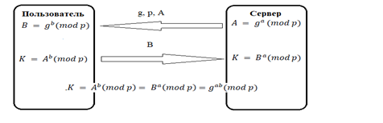

Алгоритм Диффи-Хелмана, обеспечивая конфиденциальность передачи ключа, не может гарантировать того, что он прислан именно тем партнером, который предполагается. 

Для решения этой проблемы был предложен **протокол STS (station-to-station)**.

Этот протокол для идентификации отправителя использует технику электронной цифровой подписи. 
Подпись шифруется общим секретным ключом, после того как он сформирован.

## 11. Алгоритм Диффи-Хеллмана. Атаки на него (MITM, дискретное логарифмирование). протокол STS.

**Алгоритм Диффи-Хеллмана**.

1. Сервер отправляет пользователю параметры $g$ и $p$, а также число 
   $𝑨 = 𝒈^𝒂\mod 𝒑$

2. Пользователь на основе полученного сообщения вычисляет $𝑲 =𝑨^𝒃 \mod 𝒑$
   и $𝑩 =𝒈^𝒃 \mod 𝒑$.

3. Полученное значение $B$ отправляется на сервер.

4. Сервер, получив $B$, вычисляет $𝑲 =𝑩^𝒂 \mod 𝒑$. Таким образом, сервер и пользователь сгенерировали общий сеансовый ключ $𝑲 =𝒈^{ab} \mod p$.

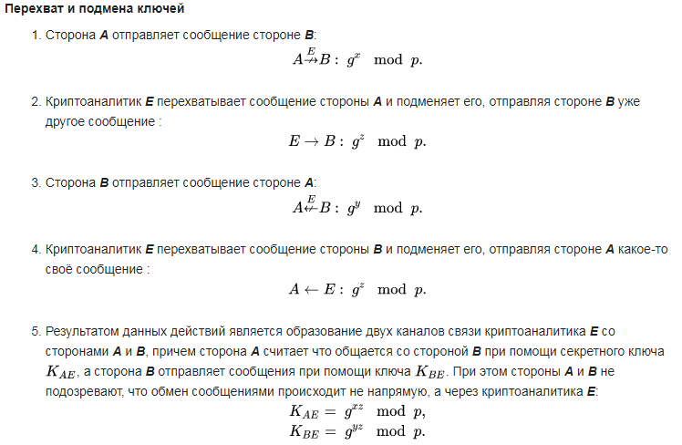

Алгоритм Диффи-Хелмана, обеспечивая конфиденциальность передачи ключа, не может гарантировать того, что он прислан именно тем партнером, который предполагается.

Для решения этой проблемы был предложен **протокол STS (station-to-station)**.

Этот протокол для идентификации отправителя использует технику электронной цифровой подписи. 
Подпись шифруется общим секретным ключом, после того как он сформирован.

### **Атаки на алгоритм Диффи-Хеллмана**:

#### **MITM атака**

Рассмотрим атаку на протокол выработки общего секрета Диффи-Хеллмана между сторонами $A$ и $B$. Допустим, криптоаналитик $E$ имеет возможность не только перехватывать сообщения, но и подменять их своими, то есть осуществлять активную атаку

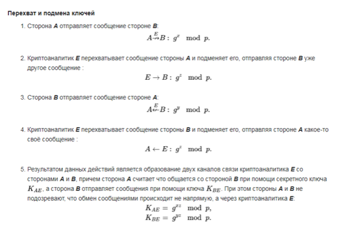

#### Дискретное логарифмирование

 Пусть в некоторой конечной мультипликативной абелевой группе ${\displaystyle G}$ задано уравнение
${\displaystyle g^{x}=a}$.     (1)

Решение задачи дискретного логарифмирования состоит в нахождении некоторого целого неотрицательного числа ${\displaystyle x}$, удовлетворяющего уравнению (1). Если оно разрешимо, у него должно быть хотя бы одно натуральное решение, не превышающее порядок группы. Это сразу даёт грубую оценку сложности алгоритма поиска решений сверху — алгоритм полного перебора нашёл бы решение за число шагов не выше порядка данной группы.

Чаще всего рассматривается случай, когда ${\displaystyle G=\langle g\rangle }$, то есть группа является циклической, порождённой элементом ${\displaystyle g}$. В этом случае уравнение всегда имеет решение. В случае же произвольной группы вопрос о разрешимости задачи дискретного логарифмирования, то есть вопрос о существовании решений уравнения (1), требует отдельного рассмотрения. 

### Протокол STS

Итак, алгоритм Диффи-Хелмана, обеспечивая конфиденциальность передачи ключа, не может гарантировать того, что он прислан именно тем партнером, который предполагается. 

Для решения этой проблемы был предложен протокол **STS (station-to-station)**.

Этот протокол для идентификации отправителя использует технику электронной цифровой подписи. 
Подпись шифруется общим секретным ключом, после того как он сформирован.

В криптографии центр сертификации или удостоверяющий центр (англ. Certification authority, CA) — сторона (отдел, организация), чья честность неоспорима, а открытый ключ широко известен. Задача центра сертификации — подтверждать подлинность ключей шифрования с помощью сертификатов электронной подписи.

Технически центр сертификации реализован как компонент глобальной службы каталогов и отвечает за управление криптографическими ключами пользователей. Открытые ключи и другая информация о пользователях хранится удостоверяющими центрами в виде цифровых сертификатов.

Цифровой сертификат — выпущенный удостоверяющим центром электронный или печатный документ, подтверждающий принадлежность владельцу открытого ключа или каких-либо атрибутов.

Сертификат открытого ключа удостоверяет принадлежность открытого ключа некоторому субъекту, например, пользователю. Сертификат открытого ключа содержит имя субъекта, открытый ключ, имя удостоверяющего центра, политику использования соответствующего удостоверяемому открытому ключу закрытого ключа и другие параметры, заверенные подписью удостоверяющего центра.

Сертификат открытого ключа используется для идентификации субъекта и уточнения операций, которые субъекту разрешается совершать с использованием закрытого ключа, соответствующего открытому ключу, удостоверяемому данным сертификатом.

## 12. Алгоритм RSA. Вспомогательная функция. Атака Хастеда, на основе малой экспоненты, Винера

**RSA** (аббревиатура от фамилий Rivest, Shamir и Adleman)—криптографический алгоритм с открытым ключом, основывающийся на вычислительной сложности задачи факторизации больших целых чисел.

### Генерация ключей

1. Выбираем два произвольных простых числа $p$ и $q$ .
2. Вычисляем их произведение $n = p · q$ и функцию Эйлера
   $φ(n) = (p − 1) · (q − 1)$
3. Выбираем случайное число $e, 2 ≤ e < n$, взаимно-простое с $n$.
   Последнее означает, что $Н.О.Д(n, e)=1$. 
   Объявляем число $e$ **открытым ключом** RSA.
4. Вычисляем элемент $d, 1 < d < n$, обратный к $e$ по модулю $φ(n)$. Иначе
   говоря, $d$ должен удовлетворять условию
   $e · d \mod φ(n) = 1$
   Для вычисления d необходимо использовать обобщенный алгоритм Евклида.
   Объявляем число d **закрытым ключом RSA**.

### Шифрование

Для шифрования текстовой строки $M$ выполним следующие действия:

1. Разобьем текст на отдельные символы.
2. Заменим последовательность символов последовательностью их кодов
   (например, в стандартной кодировке Win 1251).
3. Зашифруем последовательность, заменяя каждый код c на шифрокод
   по формуле:
   $h = enc(c) = c^𝒆 \mod n$

### Вспомогательная функция

Для реализации алгоритма RSA требуется использовать алгоритм быстрого возведения в степень по модулю заданного натурального числа.
Предположим, что требуется вычислить $z = a ^b \mod n$.
Рассмотрим следующий алгоритм:

1. Представим $b$ в двоичный системе исчисления: $b = (b_0,b_1,\dots,b_k)_2 $ ,
   $b _i  ∈ \{0, 1\}$. Например, 199 = 110001112 ,
2. Заполним следующую таблицу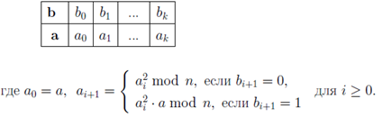

Результат появится в последней ячейке второй строки.

### Атаки на алгоритм RSA

Атака Хастеда, Атака на основе малой экспоненты, Атака Винера.

## 13. Методы факторизации натуральных чисел. Экспоненциальные алгоритмы (Ферма, Ро-метод, P-1 метод, p+1 Метод Уильямса).

Факторизацией целого числа называется его разложение в произведение простых сомножителей. Такое разложение, согласно основной теореме арифметики, всегда существует и является единственным (с точностью до порядка следования множителей). Все методы факторизации в зависимости от их производительности можно разбить на две группы: экспоненциальные методы и субэкспоненциальные методы. Все эти методы достаточно трудоемки, поэтому требуют значительных вычислительных ресурсов для чисел большой длины. Однако теоретическое обоснование необходимой сложности таких вычислений или, другими словами, существование высоких нижних оценок не доказано, поэтому вопрос о существовании алгоритма факторизации с полиномиальной сложностью на классическом компьютере для выполнения факторизации является одной из важных открытых проблем современной теории чисел. В то же время факторизация с полиномиальной сложностью возможна на квантовом компьютере с помощью алгоритма Шора. В этой главе мы дадим описание наиболее известных алгоритмов факторизации, имеющих экспоненциальную оценку сходимости.

Не уверен нужно ли расписывать методы... НО!

### Метод Ферма

Пусть $n= p \cdot q $ – известное целое число, являющееся произведением двух неизвестных простых чисел $p$ и $q$ , которые требуется найти. Большинство современных методов факторизации основано на идее, предложенной еще Пьером Ферма, заключающейся в поиске пар натуральных чисел $A$ и $B$ таких, что выполняется соотношение:
$n = A^2 − B^2$
Алгоритм Ферма может быть описан следующим образом:

1. Вычислим целую часть от квадратного корня из $n$:
   $m = \left \lceil\sqrt{n}\right\rceil$.

2. Для $x = 1, 2, \dots$ будем вычислять значения
   $q(x) = (m + x)^2 − n$, 

до тех пор, пока очередное значение q(x) не окажется равным полному квадрату.

3. Пусть $q(x)$ является полным квадратом, например, числа $B : q(x) =
   B^2 $. Определим $A = m + x$, откуда из равенства $A^2 − n = B^2$ найдем $n =
   A^2 − B^2 = (A + B) \cdot (A − B)$, и искомые делители $p$ и $q$ вычисляются, как $p = A + B , q = A − B $.

### $\rho$-Метод Полларда

Этот метод был разработан Джоном Поллардом в 1975 г. Пусть $n$ – число, которое следует разложить. $ρ$-метод Полларда работает следующим образом:

1. Выбираем небольшое число $x_0 $и строим последовательность чисел $\{x_n\}, n = 0, 1, 2,\dots$, определяя каждое следующее $x_{n+1}$ по формуле $x_{n+1} = (x^2_n − 1) \mod n$.
2. Одновременно на каждом шаге $i$ вычисляем Н.О.Д $d$ числа $n$ и всевозможных разностей $|x_i − x_j |$, где $j < i$.
3. Когда будет найдем $d =Н.О.Д.(n, |x_i −x_j |)$, отличный от 1, вычисление заканчивается. Найденное $d$ является делителем $n$. Если $\frac{n}{d}$ не является простым  числом, то процедуру можно продолжить, взяв вместо $n$ число $\frac{n}{d}$

### $p-1$-Метод Полларда

Пусть $n$ факторизуемое число, а $1 < p < n$– его простой делитель. Согласно малой теореме Ферма, для любого $a, 1 ≤ a < p$, выполняется условие $a^{p−1} ≡ 1 \mod p$. Это же сравнение выполнится, если вместо степени $p − 1$ взять произвольное натуральное число $M$ кратное $p−1$, т.к. если $M = (p−1)·k $, то $a^M = (a^{p−1})^k ≡ 1^k ≡ 1 \mod p$. Последнее условие эквивалентно $a^M − 1 = pr$ для некоторого целого $r$ . Отсюда, если $p$ является делителем числа $n$, тогда $p$ является делителем наибольшего общего делителя $Н.О.Д.(n, a^M − 1)$ и совпадет с $Н.О.Д.(n, a^M − 1)$, если $a^M-1<n$. Пусть 

$p − 1 = p^{r_1}_i · p^{r_2}_ 2 · \dots· p^{r_t}_t $.
Идея $(p − 1)$–метод Полларда состоит в чтобы выбрать $M$ в виде произведения как можно большего числа простых сомножителей или их степеней так, чтобы $M$ делилось  на каждый сомножитель $p^{r_i}_i$ , входящий в разложение выше. Тогда, $Н.О.Д.(n, a^M − 1)$ даст искомый делитель. Алгоритм состоит из двух стадий:

#### Первая стадия:

1. Сначала выберем границу $B_1$ .
2. Определим множество $P$ , состоящее из простых чисел и их степеней, меньших границы $B_1$ :
   $P = \{p^{r_1}_i, p^{r_2}_ 2, \dots, p^{r_k}_k\}, p^{r_i}_
   i < B_1$.
3. Вычислим произведение
   $M = M (B_1) = \prod_ {p^{r_i}_i \in P} {p^{r_i}_i}$
4. Выберем произвольное число $a$, например 2, и вычислим $a^M \mod n$.
5. Вычислим $Н.О.Д.(n, a^M −1)$, который, если повезет даст искомый делитель числа $n$.

#### Вторая стадия:

Если в результате первого этапа алгоритм не выдает требуемого делителя, то можно либо увеличить границу $B_1$ , либо начать вторую стадию работы алгоритма.
Вторая стадия алгоритма предполагает, что существует только один простой множитель $q $ числа $p − 1$, значение которого больше границы $B_1$.
Выберем новую границу $B_2 >>B_1$ , например, $B_2 = B^2$ . Обозначим через $b$ число $a^{M (B)} \mod n$, вычисленное на первой стадии работы алгоритма.
Выпишем последовательность $q_0 < q_1 < ... < q_s$ всех простых чисел на интервале $[B; B_2]$. Для построения этого множества можно воспользоваться решетом Эратосфена, либо решетом Аткина. 

Поскольку наличие в последовательности $\{q_i\}$ нескольких составных чисел не испортит работы алгоритма, можно выполнить только частичное просеивание, отсеяв  числа, кратные небольшим простым числам. Это ускорит общую работу алгоритма. 

Если искомый множитель $p − 1$ равен $q_i$ , то для нахождения делителя $n$, необходимо вычислить $c_i = b^{q_i} \mod n$, и найти $Н.О.Д.(n, с_i − 1)$. Поскольку, значение $q$ неизвестно, мы должны выполнить последние две операции с каждым числом $q_i$ из интервала $[B_1; B_2]$. Поллард предложил следующий вариант организации этой процедуры. Обозначим через $δ_i$ разность между соседними простыми числами $δ_i = q_{i+1} − q_i$ . Возможные значения, принимаемые $d_i$ , лежат в небольшом множестве $D = {2, 4, ..., 2^t}$. Можно заранее вычислить все значения $b^δ \mod n$ для $δ ∈ D$ и сохранить полученные числа в массиве. Вторая стадия алгоритма выполняется следующим образом:

1. Вычислим сначала $c_0 = b^{q_0} \mod n$, и найдем $d =Н.О.Д.(n, с_0 − 1)$.
2. Если $d = 1$, то вычислим следующее $c_1 = b^{q_1} \mod n$ и $d =Н.О.Д.(n, с_1 − 1)$ и т.д.
3. Каждое последующее значение $c_{i+1}$ вычисляется по формуле
   $b^{q_{i+1}} \mod n = b^{q_i+δ_i} \mod n = b^{q_i} \cdot b^{δ_i} \mod n = c_i · b^{δ_i} \mod n$.

Поскольку все значения $b^{δ_i} \mod n$ заранее вычислены, то для вычисления очередного значения $c_{i+1}$ достаточно одной операции умножения и вычисления остатка по модулю $n$. Поэтому вторая стадия алгоритма Полларда выполняется очень быстро.

### $(p+1)$-Метод Уильямса

**Определение**: Последовательностью Люка (Lucas) назовем реккурентную последовательность un , определяемую соотношениями:
$u_0 = 0, u_1 = u, u_{n+1} = P · u_n − Q · u_{n−1}$, (2.26)
где $P$ , $Q$ – фиксированные целые числа.
$(p + 1)$–метод Вильямса (Williams) похож на $(p − 1)$–метод Полларда и основан на предположении гладкости числа $p + 1$. Пусть $p$–простой делитель факторизуемого числа $n$, и выполнено разложение $p + 1$

$p + 1 = \prod_{i=1}^k{q^{a_i}_i} .$
Обозначим через $B = \max\{q^{a_i}_i |1 ≤ i ≤ k\}$. По-прежнему будем называть натуральное число $r$ $B$–степенно-гладким, если наибольшая степень сомножителя $p^{a_i}_i$в разложении $r$ на простые множители, не превышает $B$ . Таким образом, определенное выше число $B$ является наименьшим числом, для которого $p + 1$ является $B$ –степенно-гладким.
Отметим, что поскольку $p$ не известно, то и $B$ так же не известно.
Алгоритм Уильямса заключается в следующем:

1. Выбираем некоторое число $B$ , являющее верхней границей для рассматриваемых простых чисел и их степеней.
2. Строим последовательность простых чисел $2 < 3 < 5 < ... < p_m$ , меньших $B$ и последовательность степеней $a_i$ такую, что $p^{a_i}_i < B$ .
3. Полагаем число $R = \prod^m_{ i=1} {q^{a_i}_i}$ . Если $p$ является $B$–степенно-гладким, то $R$ делится на $p$.
4. Выбираем случайным образом числа $P$ и $Q$ и строим последовательность чисел Люка, пока не вычислим $u_R$ .
5. Далее вычислим $Н.О.Д.(n, u_R) = d$. Если $1 < d < n,$ то задача решена.

Доказано, что если $Q$ взаимно просто с $p$ и $(\frac{P^2 − 4Q} {p} ) = −1$, то свойства последовательности Люка обеспечивают нахождение нетривиального делителя числа $n$.

## 14. Методы факторизации субэкспоненциальной сложности. Метод квадратичного решета.

Факторизацией целого числа называется его разложение в произведение простых сомножителей. Такое разложение, согласно основной теореме арифметики, всегда существует и является единственным (с точностью до порядка следования множителей). Все методы факторизации в зависимости от их производительности можно разбить на две группы: экспоненциальные методы и субэкспоненциальные методы. Все эти методы достаточно трудоемки, поэтому требуют значительных вычислительных ресурсов для чисел большой длины. Однако теоретическое обоснование необходимой сложности таких вычислений или, другими словами, существование высоких нижних оценок не доказано, поэтому вопрос о существовании алгоритма факторизации с полиномиальной сложностью на классическом компьютере для выполнения факторизации является одной из важных открытых проблем современной теории чисел. В то же время факторизация с полиномиальной сложностью возможна на квантовом компьютере с помощью алгоритма Шора.

Алгоритмы субэкспоненциальной сложности: Метод Диксона, квадратичного решета, решета числового поля, алгоритмы факторизации на основе эллиптических кривых.

### Метод Квадратичного решета.

Метод факторизации квадратичным решетом — это алгоритм, используемый для разложения больших целых чисел на простые множители. Он является одним из самых эффективных методов факторизации для чисел среднего размера и основывается на идее нахождения гладких чисел, которые можно разложить на множители из небольшого набора простых чисел. Вот основные шаги алгоритма:

1. **Выбор параметров:**
   
   - Выберите базу B, состоящую из небольших простых чисел:
     
      $B = \{p_1​,p_2​,\dots,p_k​\}$
   
   - Определите границу гладкости $S$, которая зависит от размера числа $n$, которое вы хотите факторизовать.

2. **Поиск гладких чисел:**
   
   - Генерируйте случайные числа $x$ и вычисляйте: $y=x^2 \mod n$
   - Проверьте, является ли y $B$-гладким, то есть может ли быть разложено на простые числа из базы $B$.

3. **Создание системы уравнений:**
   
   - Для каждого найденного $B$-гладкого числа y запишите его разложение в виде произведения степеней простых чисел из базы $B$: $y=p_1^{e_1}​​p_2^{e_2}​\dots p_k^{e_k}​​$
   - Это даст вам систему линейных уравнений по модулю 2: $e_1​+e_2​+\dots+e_k​≡0 \mod 2$

4. **Решение системы уравнений:**
   
   - Используйте метод Гаусса для решения системы линейных уравнений по модулю 2.
   - Найдите такие $x_i$​, для которых произведение соответствующих $y_i​$ является полным квадратом: $y_1​y_2​\dots y_m​=z^2$

5. **Поиск факторов:**
   
   - Вычислите произведение $x_i​$ и $y_i$​ для найденных решений: $x=x_1​x_2​\dots x_m​$
   - Если произведение $y_i​$ является полным квадратом, то вы можете найти нетривиальные множители числа $n$: $\gcd(x−z,n)$

6. **Проверка и вывод результатов:**
   
   - Проверьте, являются ли найденные множители нетривиальными (то есть отличными от 1 и $n$).
   - Если да, то вы нашли факторы числа $n$.

Этот метод эффективен для чисел среднего размера, но для очень больших чисел может потребоваться более сложный алгоритм, такой как общее числовое решето.

## 15. Дискретное Логарифмирование. Алгоритм Гельфонда-Шэнкса (Baby-step Giant-step)

Задача дискретного логарифмирования - ешё одна (наряду с факторизацией) задача, на сложности которой основана стойкость ряда криптосистем, самые известные из которых - схема распределения ключей Диффи-Хеллмана и криптосистема Эль-Гамаля. Состояние дел относительно её сложности такое же, как и для задачи  факторизации - на сегодня не найдено полиномиальных алгоритмов её решения, но и не доказано, что их не существует.
Пусть $G$ - конечная циклическом группа с порождающим элементом $g$ $(G = <g>)$, $|G| = n$ и $a$ - произвольный элемент из $G$. Тогда существует единственное целое значение $х, 0 \le х < n$, такое, что $a = g^x$ Это значение $x$ называется дискретным логарифмом $a$ по основанию $g$, обозначается $х = \log_ga$.

## 16. Дискретное Логарифмирование. $\rho$-метод Полларда для дискретного логарифмирования.

## 17. Введение в симметричные методы шифрования. Примитивные операции. Блочные и поточные шифры. Сеть Фейстеля, SP-сети.

Работают быстро, сложно передавать и хранить ключи чтобы их не достали. Это делается комбинированием с асимметричными методами. Делятся на Блочные и Поточные шифры.

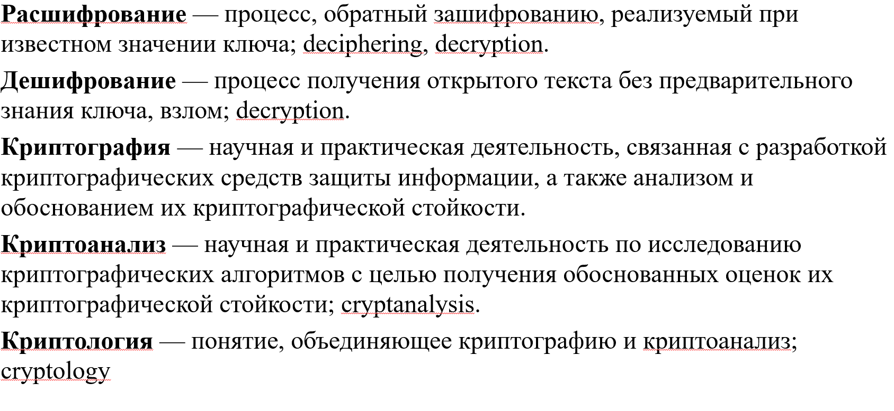

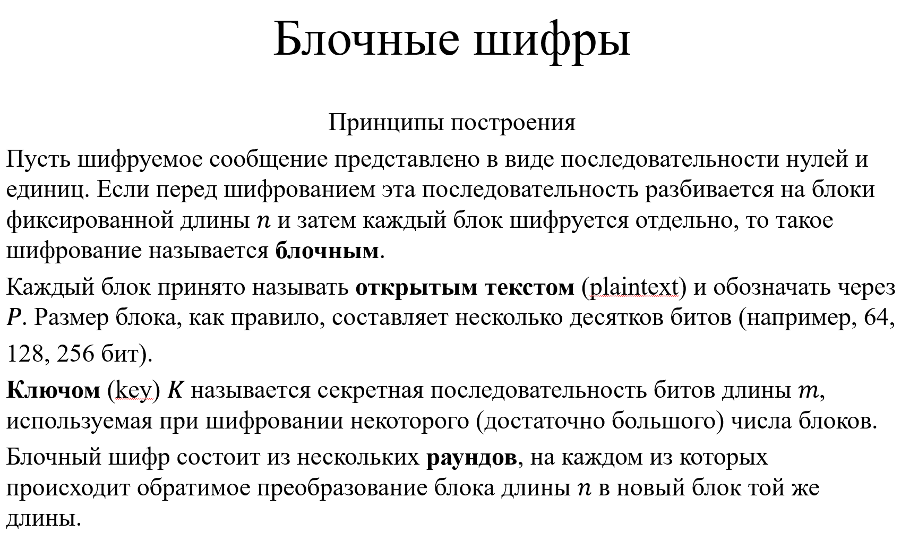

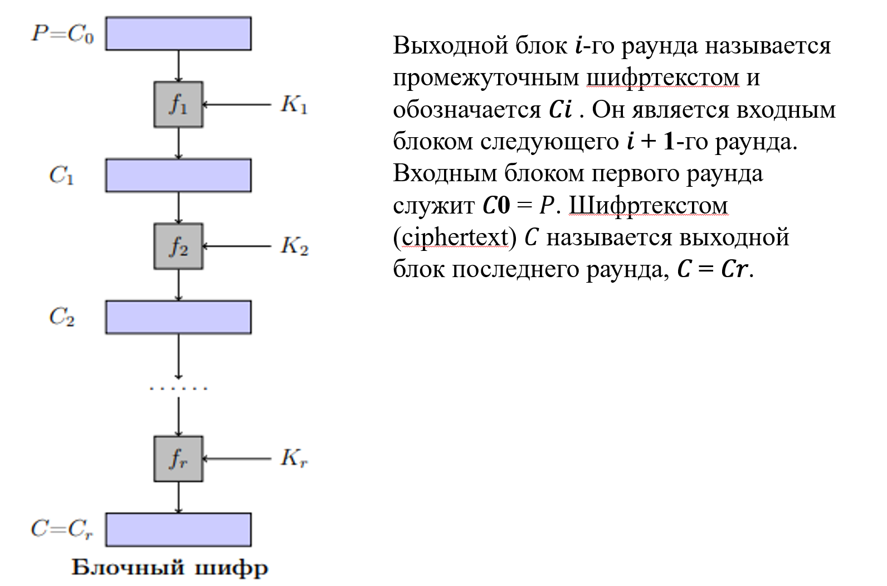

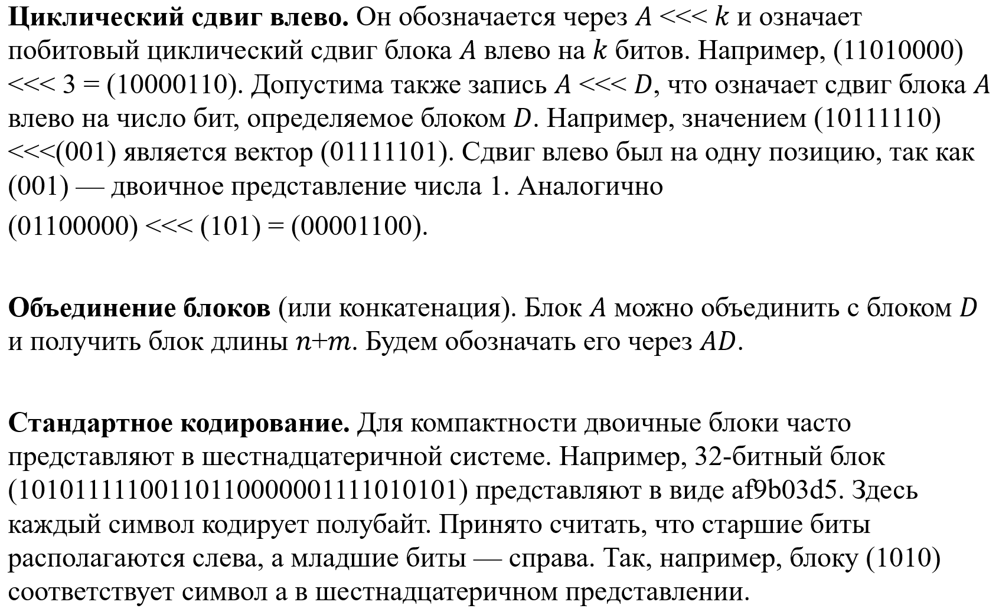

Большая их часть строится на сетях Фейстеля или SP сетях. В зависимости от того, какой алгоритм, меняется в основном функция Фейстеля.

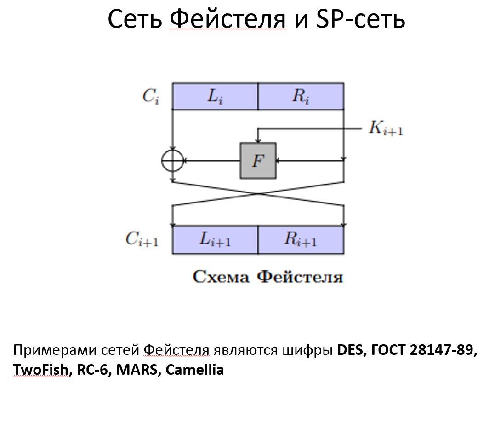

## 18. Введение в симметричные методы шифрования. Простые алгоритмы шифрования (Цезаря, АТБАШ, Play-fire, шифр сдвига, магический квадрат, гаммирование, Вижнера).

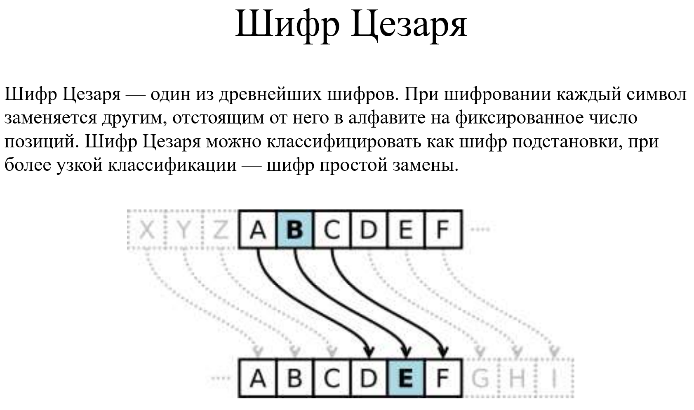

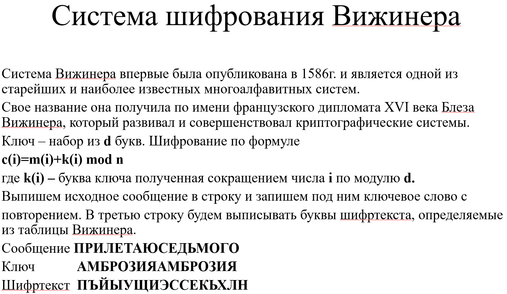

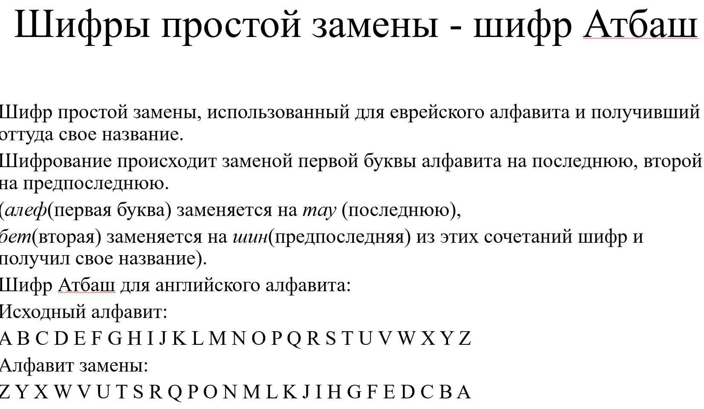

Гаммирование - XOR сообщения, переведённого в двоичный вид с гаммой, т.е. случайным набором 0 и 1 полученным со стандартным распределением и имеющим одинаковое количество 0 и 1 (абсолютно криптостойкий шифр).

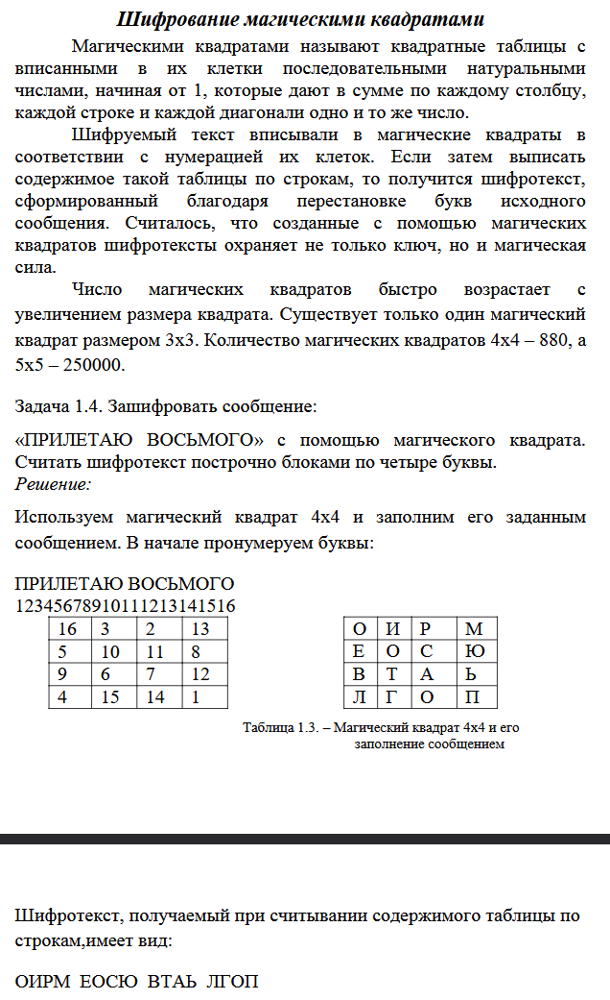

## 21. Алгоритм DES. Раундовые Ключи.

DES стандарт в США для важной но не секретной информации с 1980 по 1998

в 70х АНБ объявили конкурс который выиграли IBM с шифром Lucifer, который стал основой DES

АНБ поменяли размер ключа с 128 до 56 бит, поменяли s блоки (по одной версии для бэкдоров, по другой - для безопасности).

Шифрует блоки длиной 64 бита. Длина ключа - 56 бит. Число раундов - 16.

Будем считать что в каждом блоке биты нумеруются слева направо с первого бита. Ключ $K$ представляется блоком длины 64 бита. каждый восьмой бит - зависимый. Он равен сумма по модулю 2 предыдущих 7 битов + 1. Такие биты - проверки на чётность. На этапе подготовки из этого 64 битного ключа формируется 16 подключей длины 48 (ПО ТАБЛИЧКЕ). Сначала по ключу $K$ строятся блоки $C_0$ и $D_0$ (В презе), каждый из 28 битов. В них не входят зависимые биты ключа $K$. Далее, начиная с блоков $C_0$ и $D_0$ начинаем строить блоки $C_i$ и $D_i$ (в которые входят числа от 1 до 16). Они получаются из $C_{i-1},D_{i-1}$ и по таблице (в презе) смотрим куда надо циклически сдвинуть (на какое кол-во бит влево). Потом подключ $K_i$ (48 битов) формируется для $i$ раунда из $C_i,D_i$ (56 битов) по табличке (первые 28 - из $C_i$, дальше из $D_i$).

## 22. Алгоритм DES. Схема шифрования и раундовая функция.

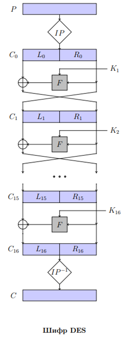

Схема шифрования в презе. Блок plaintext подаётся на вход как начальная перестановка (IP) и перестанавливается (по таблице). полученный блок разбивается на левую и правую половины $L_0,R_0$. По сети фейстеля вычисляется всё от 1 до 15 раунда. На 16 раунде работает подругому. В нём $L_{16},R_{16}$ не меняются местами. После всего этого идет обратная перестановка (по ещё одной таблице). Шифрование и дешифрование совпадают. Раундовые ключи надо применять в обратном порядке для дешифрования. Проходит NIS тесты.

На каждом раунде применяется одна и та же раундовая функция от $R_{i-1},K_i$. Результат XOR с $L_{i-1}$

$R_{i-1}$ (32 бита) и результат функции тоже 32 битный вектор (потому что надо XOR с левой частью). Из 32 битного блока делаем 48 битный через расширяющую подстановку E (табличка в презе) становится 48 битным. Некоторые биты в рамках этого процесса дублируются. Полученное E XOR с $K_i$, полученный 48 битный блок разбиваем на 8 блоков длины 6 бит и они идут на вход S блокам, после которых выходит по 4 бита. Полученный 32 битный блок прогоняем через P-блок (очередная перестановка по табличке). ТАБЛИЧКИ УЧИТЬ НЕ НАДО. S-блоки тоже приводятся через таблицу\. На вход идёт вектор 6 бит. $A_1A_6$ определяет строку в таблице, а $A_2-A_4$ - столбец. находим пересечение и переводим число на которое попали в двоичку.

пример:

Допустим 100101 и это первый блок. Получаем строку 11 и стоблец 0010 - это число 8, т.е. 1000.

## 23. Алгоритм DES. Режимы работы.

DES имеет разные режимы работы.

$DES(P,K)$ - функция, где P - текст, K - ключ. 
Первый режим - электронная кодовая книга (Electronic code block, ECB). Тут $C_i = DES(P_i,K)$ блоки $P_i$ имеют размер 64. Преимущество - простота реализации, недостаток - не создаётся лавинный эффект, небезопасно, можно применять атаку со словарём.

Второй режим сцепление блоков шифротекста (CBC, Cipher block chaining). Тут $C_i = DES(C_{i-1}\oplus P_i,K)$. Каждая следующая часть зависит от предыдущей.

Третий - обратная связь по шифротексту (CFB, Cipher feedback block(?)). $C_i = DES(C_{i-1},K)\oplus P_i$ где $C_0$ - начальный вектор. Напоминает поточное шифрование.

Четвёрный - обратная связь по выходу (OFB, Output feedback block(?)). Открытый текста гаммируется (абсолютно криптостойкий шифр). $C_i = Z_i \oplus P_i$, где $Z_i=DES(Z_{i-1},K)$, $Z_0$ - начальный вектор. Отличие от CFB: гамма не зависит от последовательности открытых текстов. Требуется отдельный анализ гаммы для взлома.

DES получил распространение как в правительственных так и в коммерческих задачах. Из-за малой длины ключа утратил статус стандарта. Перед утратой статуса, лаборатория RSA дешифровала DES менее чем за 3 дня с помощью Brute force атаки на компьютере DES Cracker. Также вышло несколько научных статей на тему криптоанализа, в которых говорится что можно применить диференциальную и линейную атаку для взлома DES. Сейчас вместо него применяется 3DES с увеличенной длиной ключа в 168 битов. 3DES долго работает, но является безопасным и применяется в VISA, для шифрования PGP.

## 24. Алгоритм ГОСТ 28147-89

На каждый раунд нужен раундовый ключ размерностью 32 бита. Исходный имеет размер 256, разбиваем на 8 блоков по 32 бита. На каждый раунд используется раундовые ключи соответсвующие $i\mod{8}$, а на последнем круге - порядок обратный, т.е. $9-i\mod8$

### Шифрование

Блок текста разбивается на левую и правую половины и проходит с 1 до 31 раунда как в DES по схеме Фейстеля. Раунд 32 вычисляется по другому: $L_{32} =L_{31}\oplus F(R_{31},K_{32}), R_{32} = R_{31}$

### Раундовая функция

На вход F получает $R_{i-1},K_i$. Оба 32 бита. Входные складываем по модулю 32 (переводим числа в 10чную систему, суммируем по модулю $2^n$ (у нас 32), снова переводим в двоичную). Эта сумма делится на 8 групп по 4 бита и подаются соответствующему S-блоку. Из них выходят тоже по 4, получаем 32 бита. Она сдвигается циклически побитово на 11 бит влево. Это будет выходом из функции.

### S-блоки

Особенность ГОСТа в том, что компетентные органы могут использовать разные наборы блоков, что делает шифрование одних организаций сильнее, а других слабее.

Алгоритм не особо быстрый. С точки зрения аппаратной реализации его конструкция очень удачная, выдерживает брутфорсы. В мире считается не достаточно хорошим для того чтобы быть стандартом, в 2010 его попробовали выдвинуть на конкурс ISO, но он проиграл AES, а позже был дважды атакован. Атаки понизили заявленную криптостойкость с $2^{228}$ до $2^{178}$.

## 25. Алгоритм AES. Шифрование. 4 Преобразования.

В 1997 году объявлен конкурс на новый стандарт блочного шифрования. Рассматривалось 15 заявок, вышло в финал 5 (слайд 17), все из которых признаются криптографически стойкими, но победителем стал шифр Rijndael. после небольшой доработки этот шифр был принят новым стандартом в 2002 и получил официальное название Advanced Encryption Standart (AES). Это классическая SP-сеть (подстановочная-перестановочная). Длина шифруемого блока - 128 бит, длина ключа 128, 192 или 256 бит. Число раундов - 10, 12, 14 (в зависимости от длины ключа). Будем рассматривать версию на 128 битный ключ с 10 раундами. Каждый промежуточный шифротекст называется состоянием (State) и показывают матрицей 4х4 (18 слайд). Для 10 раундового шифрования требуется 11 подключей длины 128. Каждая ячейка в таблице a состоит из 8 битов. В самом начале блок открытого текста XOR с нулевым раундовым подключом ($K_0$) и результирующий блок ($C_0$) подаётся на вход первого раунда.

### Шифрование

Заключается в многократном применении раундового преобразования к блоку $C_0$, каждый выход $C_i$ является входом для следующего. Каждый i раунд состоит из 4 простых преобразований (на презе 19 слайд). Это происходит с 1 раунда по 9. В 10 раунде не применяется MixColumns().

### 4 Преобразования

#### SubByte()

Каждый байт состояния заменяется на другой байт с помощью S-блока $8\to 8$

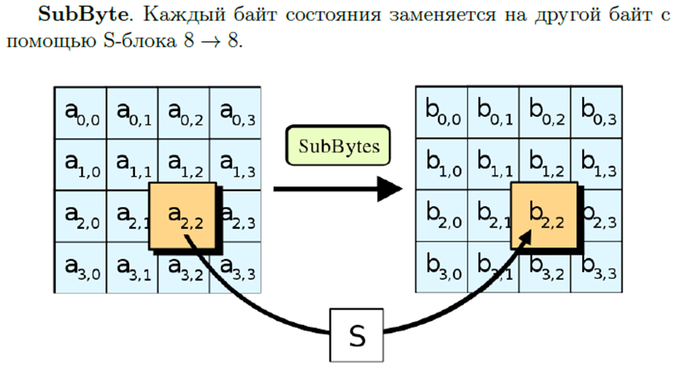

S-блок заранее фиксирован и известен. Чтобы по нему определить выходные данные надо взять набор из 8 битов на вход, представить его в 16-ричном виде и найти значения по таблице.

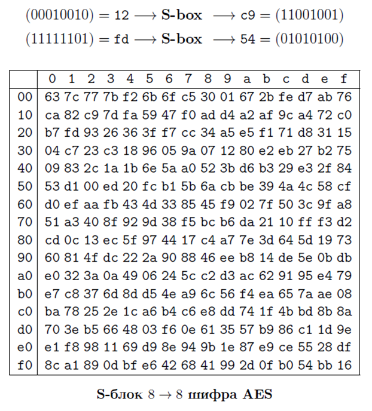

Полученное hex переводим обратно в двоичку

#### ShiftRows()

Циклический сдвиг ячеек в матрице a

Первая строка не сдвигается, вторая сдвигается на 1, третья на 2, четвёртая на 3. (т.е. сдвигаем строку влево на номер_строки-1)

#### MixColumns()

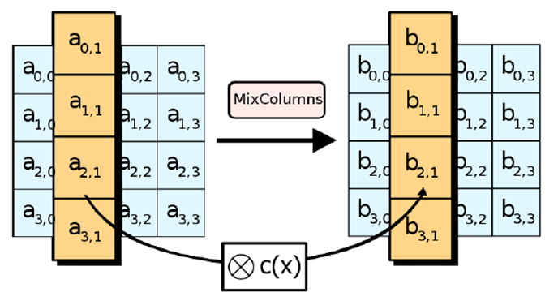

Каждый j столбец меняется на новый столбец. b получаем так:

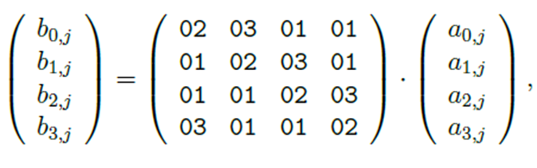

Матрица в hex умножается на заменяемый столбец. умножения и сложения рассматриваются как операции в поле $2^8$ (берём по mod $2^8$)

#### AddRoundKey()

Проводим xor соответствующих элементов a и k (матрица раундового ключа).

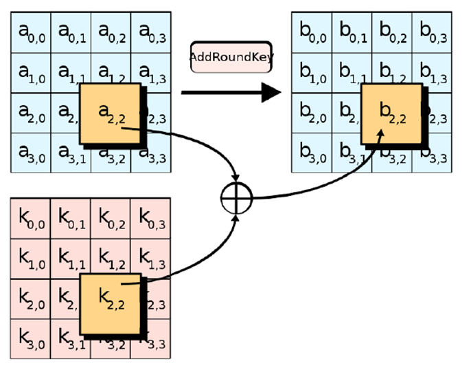

### Расшифровка

Для расшифровки надо применять раундовые ключи в обратном порядке. MixColumns тоже обратно проводится, для SybBytes есть обратная таблица.

## 26. Алгоритм AES. Раундовые ключи.

Для 10 раундового AES надо 11 (нулевой ксорим с плейнтекстом) ключей длины 128 бит.

Общая длина всех ключей 1408 бит. Из ключа k мы построим расширенный ключ размерности 1408 битов. Для этого ключ k разбивается на 4 блока $w_j,j\in[0,3]$

Каждый блок имеет длину 32 бита разбиваем равномерно. Обычно это называется словом word. Начиная с 4 элемента w мы находим по правилу:

$k'=(w_0,\dots,w_{43})\\44*32 = 1408$

Это можно делить на блоки по 128 для раундового шифрования.

$v_{n}$ имеют длину 32 бита где $n\in[1,11]$ - константы, которые задаются алгоритмом, как и таблица SubBytes.

## 27. Хэш функции. Свойства.

Используются с ЭлектронноЦифровойПодписью для проверки целостности данных. Для тех же целей можно применять контрольные суммы, биты чётности.

Функция Хэширования - детерминированная функция, получающая на вход биты произвольной длины, выдающая список битов фиксированной длины. Называются по всякому, но в основном Хэш.

$H(m)$ , где m - сообщение (Прообраз функции, исходная строка). Когда хэши проверяются или оцениваются, применяются

### Свойства Хэш функции

1. Стойкость к поиску первого прообраза. Нет эффективного полиномиального алгоритма который дал бы вычислить m по хэшу, а значит хэш - односторонняя функция.
   
   

2. Стойкость к поиску второго прообраза (коллизиям первого рода). Вычислительно невозможно зная сообщение m и его свёртку (хэш $H(m)$) найти такое другое сообщение когда $m'\ne m,H(m)=H(m')$

3. Стойкость к коллизиям второго рода. Коллизией для хэш функции называется такая пара значений m и m', что $m\ne m',H(m)=H(m')$. Допустим длина прообраза 6, а свёртки - 4 бита. Тогда число различных свёрток будет $2^4$, а число образов $2^6$. Нет эффективного полиномиального алгоритма для поиска коллизий.

Замечания:

1. Обратимая функция неустойчива к восстановлению второго прообраза и коллизиям.

2. Функция нестойкая к восстановлению второго прообраза не стойкая и к коллизиям, обратное не верно.

3. Функция, устойчивая к коллизиям, устойчива к нахождению второго прообраза.

4. Устойчивая к коллизиям хэш функция не обязательно является одностононней.

5. Хэш функция обладает лавинным эффектом, даже при малейшем изменении информации, хэш меняется полностью

## 28. Хэш функции. Схема Меркеля-Дамгарда.

Когда говорят про хэш функции упоминается схема Меркеля-Дамгарта

***Функция сжатия***- функция 2 переменных $y=f(x_1,x_2)$ где $x_1,x_2$ - битовые строки длины m, а y - битовая строка длины n

В конец хэшируемого сообщения M приписывается длина сообщения и дополнение, но так, чтобы длина сообщения стала кратна его длине (m - длина строки, которое может обработать функция сжатия). Пусть сообщение разбито на t m-битовых блоков $M_1\dots M_t$,а свёртки, получаемые в ходе итерации обозначим как $H_1\dots H_t$. IV - константа. Доказано что если функция сжатия устойчива к коллизиям, то и вся хэш функция устойчива к коллизиям.

## 29. Хэш функции. Алгоритм SHA-1. Добавление недостающих битов и указание длины, Инициализация буфера

### Характеристики

Выдаёт 160 бит хэша, длина обрабатываемого блока- 512 бит, Число шагов алгоритма - 80 (4 раунда по 20 шагов), максимальная длина данных - $2^

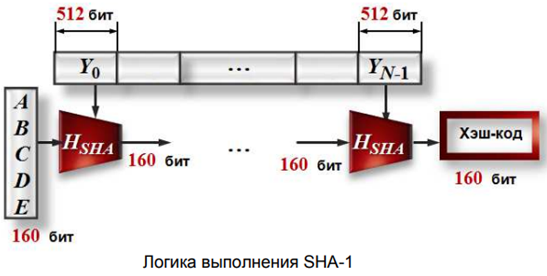

### Добавление недостающих битов и указание длины

Первый шаг. Исходное m битовое сообщение $(a_1,\dots,a_m)$ расширяется до длины, кратной 512 следующим образом: $a_1,\dots a_m,1,0,0,0,l_1,l_2,\dots,l_{64}$

$l_1,\dots,l_{64} -$ двоичная запись числа m, а s - наименьшее число при котором $(m+s+64)\mod512 = 0$. s-1 - количество нулей. Допустим подаётся 2590 битов. Сколько будет содержать дополнение сообщения

$s = -m-64\mod 512,s=-2590-64\mod 512 = -94$

Это значит что будет 1 единица и 63 нуля. 94 - ответ. Надо добавлять даже есть m кратно 512

### Инициализация буфера

Используется 160-битный буфер для хранения промежуточных и окончательных результатов хэш функции

Буфер может быть представлен как 5 32-битных регистров A,B,C,D,E, которые инициализируются следующими цифрами

## 30. Хэш функции. Алгоритм SHA-1. Обработка сообщений. Выход.

### Обработка сообщений

Основой алгоритма является модуль который состоит из 80 циклических обработок. Все 80 циклических обработок имеют одинаковую структуру. Каждый цикл получает на вход текущий 512 битный обрабатываемый блок $Y_i$. и 160-битное значение буфера A,B,C,D,E и каждый раз меняет содержимое этого буфера

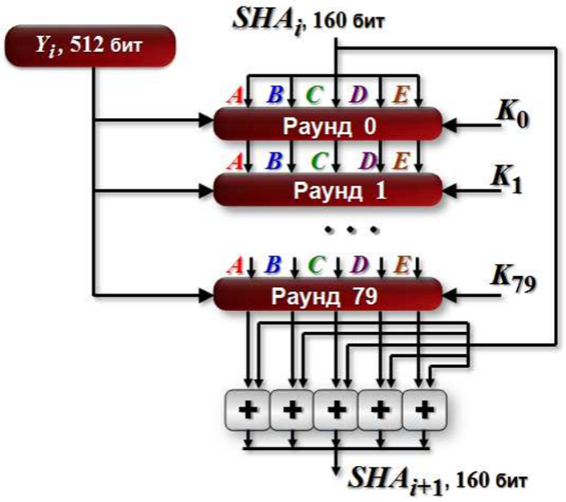

K может принимать только 4 разных значения. Эти 4 значения:

### Выход

Выходом будет 160 битный дайджест сообщения.

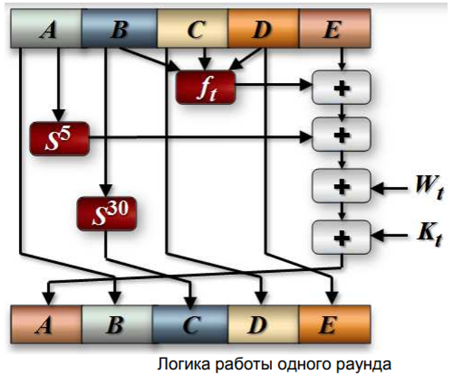

Константы $K_t$:

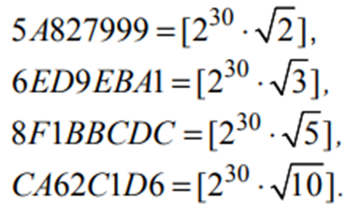

$f_t$ объяснение:

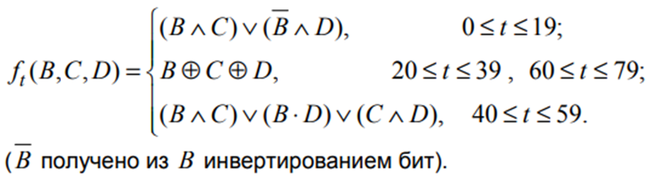

$W_t$:

## 31. Электронно-цифровая подпись. Пример на основе  RSA и MD5

Электронная Цифровая Подпись позволяет подтвердить подлинность электронного документа (будь то реальный человек или, например, аккаунт в криптовалютной системе). Подпись связывается как с автором, так и с самим документом криптографическими методами и не может быть подделана путем обычного копирования.

ЭЦП является требованием электронного документа, полученного в результате криптографического преобразования информации с закрытым ключом подписи, и позволяет проверить отсутствие искажения информации в электронном документе с момента формирования подписи (целостность), подпись принадлежит владельцу сертификата ключа подписи (авторство), и в случае успешной проверки подтверждает факт подписания электронного документа (неотказуемость). 

### Пример на основе RSA и MD5

Чтобы реализовать электронно-цифровую подпись можно использовать следующий метод: 

1. С помощью алгоритма Диффи-Хеллмана генерируем открытые и закрытые ключи между пользователями. То же самое делаем для RSA.

2. Обычные сообщения, не требующие ЭЦП шифруются только с помощью RC4 ключом, полученным на 1 шаге.

3. Для важных сообщений применяем хэширование. Перед отправкой зашифрованного сообщения мы отправляем его хэш (Хэширование с помощью MD5), зашифрованный RSA. После, отправляем само сообщение. 

4. Получающий сам хэширует полученное сообщение и сравнивает с ранее полученным хешем. Если совпали - значит изменений в файле не произошло, целостность сохранена!

## 32. Протокол X. 509

X.509 — стандарт ITU-T для инфраструктуры открытого ключа (англ. Public key infrastructure, PKI) и инфраструктуры управления привилегиями (англ. Privilege Management Infrastructure).

X.509 определяет стандартные форматы данных и процедуры распределения открытых ключей с помощью соответствующих сертификатов с цифровыми подписями.
Эти сертификаты предоставляются удостоверяющими центрами (англ. Certificate Authority). Кроме того, X.509 определяет формат списка аннулированных сертификатов, формат сертификатов атрибутов и алгоритм проверки подписи путём построения пути сертификации. X.509 предполагает наличие иерархической системы удостоверяющих центров для выдачи сертификатов.

Например сертификат МинКомСвязи содержит: Дату регистрации, ФИО, адрес, ИНН

## 33. Протокол SSL/TLS

**SSL (Secure Sockets Layer) и TLS (Transport Layer Security)** - это криптографические протоколы, предназначенные для обеспечения безопасной связи по сети.  TLS фактически является преемником SSL и считается более безопасным.

**Описание механизма защиты TLS (с учетом упомянутых ГОСТов):**

* **Аутентификация клиента и сервера:**  Процесс подтверждения, что сервер и (опционально) клиент являются теми, за кого себя выдают.  Это обычно достигается с помощью сертификатов X.509.  Сертификат содержит открытый ключ сервера и информацию о нем, подписанную доверенным центром сертификации (CA). Клиент проверяет подпись CA, чтобы убедиться в подлинности сертификата.  Использование ГОСТов в этом контексте скорее всего подразумевает использование российских криптографических стандартов для генерации ключей и формирования подписей в сертификатах.

* **Шифрование информации:** ГОСТ 28147-89 - это российский стандарт симметричного шифрования.  После согласования сеансового ключа (описывается ниже)  данные шифруются с помощью этого алгоритма, обеспечивая конфиденциальность.

* **Контроль целостности информации:** ГОСТ Р 34.11-94 (аналог MD5) - это российский стандарт хэширования.  Для обеспечения целостности данных вычисляется хэш-значение передаваемого сообщения.  Получатель также вычисляет хэш и сравнивает его с полученным значением.  Любое изменение данных приведет к различному хэшу, что позволит обнаружить подмену или повреждение информации.

* **Обмен ключами по алгоритму Диффи-Хеллмана:** Этот алгоритм позволяет двум сторонам безопасно согласовать общий секретный ключ по незащищенному каналу связи.  Этот ключ затем используется для симметричного шифрования данных (в данном случае, ГОСТ 28147-89).

**Протокол рукопожатия:**

Стандартный процесс рукопожатия TLS в общих чертах выглядит так:

1. **Client Hello:** Клиент отправляет серверу информацию о поддерживаемых им версиях TLS, шифрах и алгоритмах сжатия.

2. **Server Hello:** Сервер выбирает подходящие параметры из предложенных клиентом и отправляет свой сертификат (включая открытый ключ).

3. **Key Exchange:**  Производится обмен ключами по алгоритму Диффи-Хеллмана,  в результате которого обе стороны получают общий секретный ключ.

4. **Client Key Exchange:** Клиент отправляет серверу свою часть данных для генерации общего ключа.

5. **Server Key Exchange:** Сервер отправляет клиенту свою часть данных для генерации общего ключа.

6. **Change Cipher Spec:**  Клиент и сервер уведомляют друг друга о переходе к зашифрованной связи.

7. **Finished:**  Клиент и сервер подтверждают успешное завершение рукопожатия и начинают обмен зашифрованными данными.

**Отличия SSL от TLS:**

SSL является устаревшим и имеет известные уязвимости.  TLS - это более современный и безопасный протокол.  Основные отличия включают:

* **Улучшенное рукопожатие:** TLS имеет более надежный механизм рукопожатия, что снижает риск определенных атак.

* **Улучшенное управление ключами:** TLS предлагает более гибкие и безопасные способы управления ключами сеанса.

* **Поддержка различных шифров:** TLS поддерживает более широкий спектр криптографических алгоритмов, позволяя использовать более сильные методы шифрования.

* **Улучшенная проверка целостности:**  TLS использует более надежные механизмы проверки целостности данных, такие как HMAC.

## 34. Протоколы доказательства с нулевым разглашением секрета (Подбрасывание монеты, пещера Али-Бабы, кубик Рубика).

### Протокол подбрасывания монеты по телефону

Классический протокол на котором строятся онлайн казики и прочие штуки.

Алиса и Боб загадывают пойти куда либо. Если Боб угадывает подбрасывание монеты, идут куда хочет он, если нет - куда хочет Алиса. Для этого выбирается большое чётное и нечётное число, чётное назовём орлом, нечётное - решкой. Алиса подбросила - получила решку, нечётное шифруется своим открытым ключом и отправляет Бобу. Допустим Боб не угадал, сказав что это орёл. Алиса отправляет Бобу ключ для расшифровки. Боб расшифровал, убеждается что идёт куда хочет Алиса.

#### Задача пещеры АлиБабы

Есть Алиса и Боб. Есть пещера Али Бабы. В ней есть дверь. Алиса говорит что она знает ключ от этой двери. Боб не верит. Алиса спускается в пещеру и выходит с другой стороны. Боб не убеждён даже после перепроверки закрытости двери. Производится повторный проход для уверенности. Каждый проход через дверь удваивает шанс того, что Алиса реально знает ключ, при том что она его не показывает. Количество проходов зависит от системы. Алгоритм работает только если нет уязвимостей.

На цифрах: кого то надо пускать в систему, но мы не должны знать ключ. Мы отправляем данные и по ответам можем понять что их можно пускать.

#### Задача Кубик-Рубика

Алиса говорит что умеет разгадывать Кубик Рубика. Боб не верит. Просит написать алгоритм. Алиса говорит что она не может показать алгоритм. Алиса передаёт Кубик-Рубика чтобы Боб запутал кубик и передал обратно Алисе. Алиса его решает и отдаёт обратно Бобу. Итеративно несколько раз прогоняем и убеждаемся что Алиса знает алгоритм. По сути то же самое, но вместо неизвестного ключа неизвестный алгоритм.

## 35. Электронное голосование

Идёт голосование по закону. Допустим сразу выходит что все за. А кто знает что депутаты голосуют? Как сделать с помощью криптографии так, чтобы голосование было анонимным, но при этом подделать голоса было невозможно.

Ответ из книги Музыкантски: для решения используется RSA и затемняющий множитель. Затемняющий множитель должен быть больше чем простые числа (голос за, против, воздержался). Тоже простое. При голосе ЗА мы берём случайный затемняющий множитель в каком то диапазоне. Он умножается на наше простое число (голос). шифруем открытым ключом сервера. Отправляем. Все собранные числа, которые делятся на 2 - за, которые делятся на 3 - против и т.д. Остальные - воздержался. 

## 36. Электронные торги (Тендеры).

Надо реализовать честные Тендеры. Объявляются закупки компьютеров. Выигрывают те, кто предложил наименьшую стоимость. Мы не должны знать сколько участники предложили. 

Ответ: Объявляется открытый ключ, им участники шифруют сумму, когда пора выбирать объявляется закрытый ключ и все могут посмотреть кто сколько предложил и выиграл торги.

## 37. Задача Гроссмейстеров

Как обыграть Каспарова или Карпова или сыграть в ничью.

Надо дублировать ход одного другому. MITM атака.
